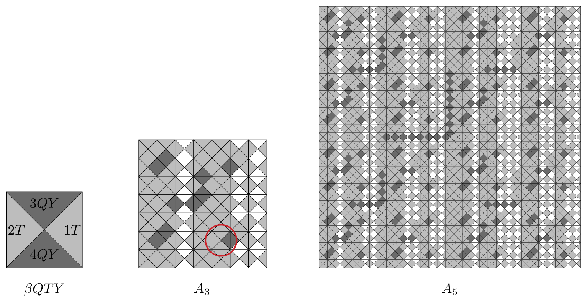

# TAOCP 7.2.2.1, Exercise 121: A Careful Reading

Written 8 September 2026, against Volume 4B, Addison-Wesley, first printing,
2022, and the errata file as of that date. The 92 tiles themselves are
specified in Volume 1, third edition, exercise 2.3.4.3–5, and its answer is
used here too.

This is one reader's response to the request on Knuth's [news
page](https://www-cs-faculty.stanford.edu/~knuth/news.html): read an exercise
and its answer very carefully, then report back.

## What I found

| Item | Finding |
| --- | --- |
| Exercise 121, statement of (c) | "(2, 3, 3, 57)" should be **(2, 2, 3, 57)** — the [errata](https://www-cs-faculty.stanford.edu/~knuth/err4b.textxt) of 7 January 2023 already say so, and the corrected numbers are what came out. |
| (a) no $2\times2$ tiling with $\beta US$ at the lower right | Confirmed. |
| (a) no $3\times4$ tiling with $\beta US$ at the lower left | Confirmed. |
| (a) $\beta US$ fits in only $n+1$ cells of an $m\times n$ array | Confirmed for four shapes; the cells are the top row and the left of the next-to-top row. |
| (b) a unique $(2^k-1)\times(2^k-1)$ tiling has $\delta RD$ in the middle | Confirmed for $k \le 5$. |
| (b) its corners are $D\_{k-1}$, $C\_{k-1}$, $B\_{k-1}$, $A\_{k-1}$ | Confirmed. |
| (c) the corrected counts $(2, 2, 3, 57)$ | Confirmed for $k = 2, 3, 4, 5$. |
| (c) the corners of the other solutions (errata of 8 Jan 2023) | Confirmed exactly. |
| (c) $\delta SU$'s 54 extras have $C\_{k-2}$ at the upper left | Confirmed, all 54 of them. |
| (c) 9 tiles in row $2^{k-2}$, 6 in row $3 \cdot 2^{k-2}$, independently | Confirmed; $9 \times 6 = 54$ and every pair occurs once. |
| (d) only one tiling of the plane survives for each | Confirmed; for $\delta SU$ it takes two levels to see. |
| "Each of the other 86 types occurs in $A\_6$" | Confirmed: $A\_6$ uses exactly 86, and the six it misses are exactly the six of (a), (b) and (c). |
| "the dragon sequence arises in the colors at the edges" | Confirmed, in every place of the top and left edges of $A\_k$ for $k \le 6$. |
| Volume 1, the block printed in answer 2.3.4.3–5 | $\gamma ST$ in its sixth row is not one of the 92 types; it has to be $\gamma SJ$. Knuth's Volume 1 errata have said so since **22 July 2005**, so this only dates the printing I worked from. |



Everything in exercise 121 and its answer came out, once the errata are applied,
and nothing new is wrong. What the exercise mainly gave me was a way to check
my own transcription of the tile specification, which is
[section 8](#8-the-misprint-that-checked-the-check) below.

The whole verification runs in under three minutes, nearly all of it in the two
$31\times31$ searches of section 6.

## 1. What the exercise asks

A **tetrad** is a unit square cut into four triangles by its diagonals, each
triangle carrying a symbol. Two of them may be placed side by side only if the
triangles that touch carry the same symbol, and they may not be rotated or
reflected. Section 2.3.4.3 of Volume 1 uses them to illustrate the infinity
lemma, and its exercise 5 exhibits 92 types that tile the plane while admitting
no periodic tiling at all.

Exercise 7.2.2.1–121 asks what a dancing-links program can say about those 92.
Its four parts are quoted in the table above; the interesting ones concern the
five tiles $\delta RD$, $\delta RU$, $\delta LD$, $\delta LU$, $\delta SU$ and
the odd tile out, $\beta US$.

This is an exact cover problem with colors, and a small one: cells of the board
are the primary items, the symbol on each shared edge is a color on a secondary
item, and one option places one type in one cell. A $15\times15$ board is 225
items and 20,700 options, and `NewXCC()` settles it in tens of milliseconds.
The program is [`verify/verify.w`](verify/verify.w).

## 2. The 92 types, and a check on the transcription

Page 385 of Volume 1 gives 22 "basic codes", each a quadruple, and names the 92
types as products of them: a type's four symbols are got by putting its codes
together component by component and sorting each component alphabetically. The
worked example there is

$$\beta QTY = (3,4,2,1)(Q,Q,\,,\,)(\,,\,,T,T)(Y,Y,\,,\,) = (3QY, 4QY, 2T, 1T),$$

drawn at the left of the picture above. Those 22 codes and the four products
that name the types had to be copied out by hand, so that transcription is the
weak link in everything that follows, and it deserved a proper test. It got
four:

- the four products come to 4, 21, 22 and 45 types, each count separately, and
  **92** in all;
- no two of the 92 turn out to be the same tile;
- $\beta QTY$ composes to Knuth's $(3QY, 4QY, 2T, 1T)$ exactly;
- and, best of all, **answer 2.3.4.3–5 prints a whole $7\times7$ block of a
  tiling**, 49 names, which must hold together if the codes, the composition
  rule and the order of the four components are all right.

The block does hold together — 48 of its 49 names are among the 92, and 80 of
its 84 internal edges match. The four that do not are the four edges of a single
cell, and that cell is section 8.

## 3. Where $\beta US$ can go

Part (a) says $\beta US$ can appear in only $n+1$ cells of an $m\times n$ array
when $m, n \ge 4$, and the answer's route is two impossibilities:

```text
2x2 with it at the lower right: 0 tilings
3x4 with it at the lower left:  0 tilings
```

Both confirmed. They are enough: a $\beta US$ that is neither in the top row nor
in the left column has a $2\times2$ above and to its left, and one below the
second row in the left column has a $3\times4$. So only the top row and the left
of the next-to-top row are left, which is $n+1$ cells. Testing every cell of four
boards agrees:

| array | cells that admit it | $n+1$ |
| --- | --- | --- |
| $4\times4$ | 5 | 5 |
| $4\times6$ | 7 | 7 |
| $5\times5$ | 6 | 6 |
| $6\times4$ | 5 | 5 |

and in each case they are the whole top row plus the leftmost cell of the row
below it, exactly as the answer says.

There is a pleasant cross-check on this. Putting each of the 92 types in turn at
the centre of a $7\times7$ board gives 134,740 tilings altogether, and **exactly
one** of the 92 admits none: $\beta US$.

## 4. The tilings with a given middle tile

Parts (b) and (c) ask for the $(2^k-1)\times(2^k-1)$ tilings with a given tile in
the middle. Note the exponent: $(2^k-1)$ is easy to misread as $(2k-1)$, and
answer 2.3.4.3–5 settles which is meant by building crosses "of height and
width $2^n-1$".

| middle | $1\times1$ | $3\times3$ | $7\times7$ | $15\times15$ | $31\times31$ |
| --- | --- | --- | --- | --- | --- |
| $\delta RD$ | 1 | 1 | 1 | 1 | 1 |
| $\delta RU$ | 1 | 2 | 2 | 2 | 2 |
| $\delta LD$ | 1 | 2 | 2 | 2 | 2 |
| $\delta LU$ | 1 | 3 | 3 | 3 | 3 |
| $\delta SU$ | 1 | 3 | 57 | 57 | 57 |

(the $31\times31$ column comes from the searches of section 6; `-k 5` puts it in
this table too, at the cost of two more minutes). This is part (b) for every
$k$, and $(2, 2, 3, 57)$ for $k \ge 3$. The exercise
prints $(2, 3, 3, 57)$, but the errata of 7 January 2023 replace that with
$(2, 2, 3, 57)$, and so does this table. The answer's own prose agrees with the
correction and always did: it says $\delta RU$ *or* $\delta LD$ gains one further
solution, and $\delta LU$ *or* $\delta SU$ a third.

## 5. What the solutions look like

The answer does not merely count these tilings, it describes them, and that is a
much sharper thing to check. Let $A\_k$, $B\_k$, $C\_k$, $D\_k$ be the tilings
that are $\alpha a$, $\alpha b$, $\alpha c$, $\alpha d$ when $k = 1$, and
otherwise have $\delta Na$, $\delta Nb$, $\delta Nc$, $\delta Nd$ in the middle
with $A\_{k-1}$, $B\_{k-1}$, $C\_{k-1}$, $D\_{k-1}$ at the corners. The cross
between the corners is forced — asking for every way to fill it gives one — so
this really does define them.

Taking each solution apart into its four corner blocks:

| middle | corners of its solutions |
| --- | --- |
| $\delta RD$ | $DCBA$ |
| $\delta RU$ | $DCBA$, $CDAB$ |
| $\delta LD$ | $DCBA$, $BADC$ |
| $\delta LU$ | $DCBA$, $CDAB$, $BADC$ |
| $\delta SU$ | $DCBA$, $CDAB$, $BADC$, and 54 more |

This is the errata's rewritten answer 121(c) line for line: $\delta RD$ has the
$D, C, B, A$ one; "with $\delta RU$ in the middle, another solution has $C\_{k-1}$,
$D\_{k-1}$, $A\_{k-1}$, $B\_{k-1}$ at the corners"; "with $\delta LD$, another
solution has corners $B\_{k-1}$, $A\_{k-1}$, $D\_{k-1}$, $C\_{k-1}$"; "both of
those solutions work with $\delta LU$ and $\delta SU$".

And the 54 others:

- all 54 have $C\_{k-2}$ in the upper left corner;
- the middle of row $2^{k-2}$ holds one of **nine** tiles, namely $\delta JL$,
  $\delta JP$, $\delta JS$, $\delta JT$, $\delta LU$, $\delta PU$, $\delta RU$,
  $\delta SU$, $\delta TU$;
- the middle of row $3 \cdot 2^{k-2}$ holds one of **six**, namely $\delta KU$,
  $\delta LU$, $\delta PU$, $\delta RU$, $\delta SU$, $\delta TU$;
- and all $9 \times 6 = 54$ combinations occur, once each.

Those are the errata's two sets $\delta\lbrace\lbrace L,P,S,T\rbrace\lbrace J,U\rbrace, RU\rbrace$
and $\delta\lbrace L,K,P,R,S,T\rbrace U$. The first looks at first sight as
though it names tiles that are not among the 92 — there is no $\delta LJ$ in the
list on page 385 — but the basic codes are put together component by component,
so they commute: $\delta LJ$ and $\delta JL$ are two spellings of one tile. The
"independently" in the errata is literal: 54 is $9 \times 6$, and every pair
happens.

## 6. Which tilings survive

Part (d) asks how many tilings of the whole plane have each of those five at the
origin, and the answer is "only one of each". A plane tiling restricts, for
every $k$, to a $(2^k-1)\times(2^k-1)$ tiling with that tile in the middle, so a
solution that is not the middle of some larger solution is already dead.

| middle | $7\times7$ tilings | in the middle of a $15\times15$ one | of a $31\times31$ one |
| --- | --- | --- | --- |
| $\delta RD$ | 1 | 1 | 1 |
| $\delta RU$ | 2 | 1 | 1 |
| $\delta LD$ | 2 | 1 | 1 |
| $\delta LU$ | 3 | 1 | 1 |
| $\delta SU$ | 57 | 2 | 1 |

One level of extension settles four of the five. $\delta SU$ is the interesting
one: two of its 57 survive a single step — one of them collecting 54 preimages
and the other 3 — and only at the second step does it come down to one.

## 7. The census of $A\_6$, and the dragon

Answer 121 ends with two remarks in brackets. The first is that "each of the
other 86 types occurs in $A\_6$, hence in every sufficiently large tiling."
$A\_6$ is $63\times63$, built by five rounds of the construction of section 5,
and it uses **86** of the 92 types. The six it does not use are

$$\beta US, \quad \delta RD, \quad \delta RU, \quad \delta LD, \quad \delta LU, \quad \delta SU,$$

which are precisely the six that parts (a), (b) and (c) are about. "The other
86" is exact.

The second remark is that "the 'dragon sequence' (see answer 4.5.3–41) arises in
the colors at the edges of $A\_\infty$, $B\_\infty$, $C\_\infty$, $D\_\infty$."
The dragon sequence is $d\_0 = 1$, $d\_{2n} = d\_n$, $d\_{4n+1} = 0$,
$d\_{4n+3} = 1$, so it runs $1, 0, 0, 1, 0, 0, 1, 1, 0, 0, 0, 1, 1, 0, 1, 1, \ldots$
Reading along the top edge of $A\_4$ the triangles are

```text
1Q  3Q  1  3Q  1Q  3  1  3Q  1Q  3Q  1  3  1Q  3  1
```

and down its left edge

```text
1P  3P  1T  3P  1P  3T  1T  3P  1P  3P  1T  3T  1P  3T  1T
```

In both, the $n\text{th}$ of them carries a $Q$ or a $P$ exactly when $d\_n = 0$. That
holds in every place of both edges of $A\_k$, checked to $k = 6$, which is 63
places. For $B\_k$, $C\_k$ and $D\_k$ it holds everywhere but one — the middle of
the edge, which is where the next level's cross attaches.

## 8. The misprint that checked the check

Answer 2.3.4.3–5 prints a $7\times7$ block of a tiling, "the $7\times7$ blocks
that are of class $Na$ in the center". In the printing I read, its sixth row is

```text
γTJ   δNc   γSB   δDS   γST   δNd   γTB
```

and **$\gamma ST$ is not one of the 92 types**. The $\gamma$ family is
$\gamma\lbrace\lbrace X,B\rbrace\lbrace L,P,S,T\rbrace, R\rbrace\lbrace B,Q\rbrace$
together with $\gamma J\lbrace L,P,S,T\rbrace$, and there is no way to write $S$
and $T$ side by side in either.

Its four neighbours leave no choice about what belongs there. They ask for a
tile whose top, bottom, left and right are $2D$, $1U$, $3S$, $4SX$, and that is

$$\gamma JS = (2,1,3,4)(D,U,\,,X)(\,,\,,S,S) = (2D, 1U, 3S, 4SX).$$

With $\gamma JS$ in that cell every one of the 49 names is among the 92 and every
one of the 84 internal edges matches; handing the repaired block to the engine
with all 49 cells pinned confirms it as a tiling. It is also exactly the block
$A\_3$ that the construction of section 5 produces, which is what it is supposed
to be.

The cell is ringed in the middle panel of the picture above.

This is not a new find. Knuth's *Earliest errata for Volume 1 (3rd ed.)* has
carried it since **22 July 2005**:

```text
xPage 587 line 7                                    22 Jul 2005
ST  →  SJ
```

$\gamma SJ$ and $\gamma JS$ are two spellings of one tile, since the basic
codes commute, so the correction and the deduction agree. All this really shows
is that the copy of Volume 1 I read is a printing from before the fix — and
that the check works: a single wrong letter in a 49-name array was caught, and
located, by the tiles alone.

## What is in this directory

| File | |
| --- | --- |
| [`verify/verify.w`](verify/verify.w) | the program, as a literate document |
| [`verify/verify.pdf`](verify/verify.pdf) | the same, typeset |
| [`verify/tetrads.mp`](verify/tetrads.mp) | the picture, in MetaPost |
