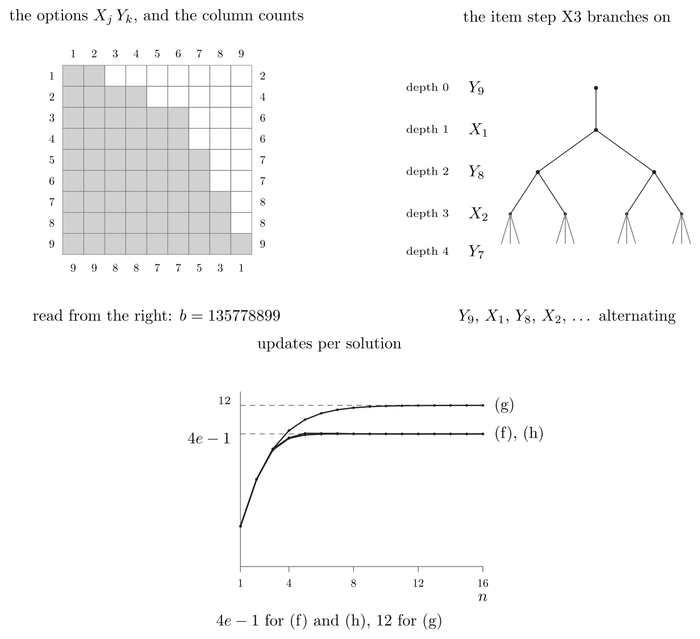

# TAOCP 7.2.2.1, Exercise 196: A Careful Reading

Written 9 September 2026, against Volume 4B, Addison-Wesley, first printing,
2022, and the errata file as of that date.

This is one reader's response to the request on Knuth's [news
page](https://www-cs-faculty.stanford.edu/~knuth/news.html): read an exercise
and its answer very carefully, then report back.

## What I found

| Item | Finding |
| --- | --- |
| Exercise 196 (statement) | No error. |
| (a) the dual of $246677889$ | Confirmed: $135778899$. |
| (b) dual options, and inverse solutions | Confirmed; exhaustively for $n \le 7$. |
| (c) $1 + a\_1(n+1)$ updates at the root | Confirmed. |
| (d) $a\_1(a\_2-1)\ldots(a\_n-n+1)$ solutions | Confirmed; exhaustively for $n \le 9$. |
| (d) the same product for $b$ — "not an obvious fact" | Confirmed; exhaustively for $n \le 9$. |
| (e) $1 + \sum (n+3-j)\Pi\_j - \Pi\_n$ updates | Confirmed; exhaustively for $n \le 9$. |
| (f) $\approx (4e-1) n!$ for all permutations | Confirmed; the ratio is $9.873127$. |
| (g) $6 \cdot 2^n - 2n - 7$ | Confirmed exactly, $1 \le n \le 16$. |
| (h) $\Pi\_n = \lfloor (n{+}1)/2 \rfloor \lfloor (n{+}2)/2 \rfloor$ | **Two factorial signs are missing.** |
| (h) the series $6 + 4/1! + 5/2! + \cdots \approx 4e-1$ | **The leading term is 2, not 6.** |
| (i) $1 + b\_1(n+1)$ updates at the root when $b\_1 < a\_1$ | Confirmed; every one of 9055 cases. |
| (i) "the first branch is on $Y\_n$" | Not always: 1324 of those 9055 branch on an earlier $Y$. |
| (i) "branches on $Y\_9$, then $X\_2$, then $Y\_8$" | **It branches on $Y\_9$, then $X\_1$, then $Y\_8$, then $X\_2$.** |

Answer 196 is nine claims deep and the first seven of them come out exactly, on
every problem I could throw at them. Everything questionable sits in two
places: one line of answer (h), and one sentence of answer (i).



The whole verification runs in about 34 seconds.

## 1. What the exercise asks

A *bounded permutation problem* is introduced on page 103: given positive
integers $a\_1 \ldots a\_n$, find all permutations $p\_1 \ldots p\_n$ of
$\lbrace 1, \ldots, n \rbrace$ with $p\_j \le a\_j$. One may assume
$a\_1 \le \cdots \le a\_n$, and $a\_j \ge j$ (otherwise there are no solutions),
and $a\_n \le n$. It is a 2D matching problem with $2n$ items
$X\_1, \ldots, X\_n$, $Y\_1, \ldots, Y\_n$ and the $a\_1 + \cdots + a\_n$
options `Xj Yk` for $1 \le k \le a\_j$.

Exercise 196 defines the *dual* problem $b\_1 \ldots b\_n$, where $b\_k$ counts
the $j$ with $a\_j \ge n+1-k$, and asks nine questions about it: what the dual
of one particular sequence is (a); why its solutions are the inverses of the
original's (b); how many updates the root of the search tree costs (c); how many
solutions there are (d); the total number of updates (e); that total for three
families of sequences (f), (g), (h); and finally (i), which admits that the
assumption underlying (e) — that Algorithm X branches on $X\_j$ at depth $j-1$ —
is not always what happens.

Every one of the nine is a number or a formula, so every one of them can be
measured.

## 2. What an "update" is, and why this program brings its own Algorithm X

An update, in Section 7.2.2.1, is the removal of an option from an item's list.
Knuth's `DLX2` and its descendants count one for each node that `hide` unlinks
and one more for each item that `cover` removes from the list of items still to
be covered, and report the total beside the number of solutions. So the
quantity this exercise analyzes is a property of the doubly linked lists, not
of exact cover as such.

That rules out the engines in this repository. `ssxcc` and its relatives
descend from Knuth's sparse-set programs, where covering an item shortens a set
instead of unlinking nodes, and where items of size one are forced before any
branching happens at all. Their update counts are their own and would answer a
different question. So `verify/verify.w` carries a plain Algorithm X, its
`cover`, `hide`, `uncover` and `unhide` exactly as in (12)–(15) of the text,
with `updates` incremented in exactly the two places Knuth increments it. `ssxcc` still gets a say: it is asked for a
second opinion on the number of solutions, which no algorithm can disagree
about.

The one implementation detail that matters is the tie-break in step X3.
Knuth's programs scan the active items in order and keep a new candidate only
when its length is *strictly* smaller, so the leftmost of the shortest items
wins. Our items are declared $X\_1, \ldots, X\_n, Y\_1, \ldots, Y\_n$, which is
the order the exercise uses.

## 3. The dual, and the inverses

Part (a) is arithmetic: with $a = 246677889$ and $n = 9$,

$$b\_k = |\lbrace j : a\_j \ge 10-k \rbrace| = 1, 3, 5, 7, 7, 8, 8, 9, 9,$$

which is the printed $135778899$. The dual is again canonical, and dualizing it
returns $a$, as a conjugate partition should.

The left panel of the figure is the same fact drawn. The filled cells are the
options; the numbers down the right are the $a\_j$; the numbers along the bottom
are the column counts $9, 9, 8, 8, 7, 7, 5, 3, 1$, and read from the right they
are $b$. Answer (a)'s advice — draw the bipartite graph and rotate it
$180^\circ$ — is that statement seen from the side: rotating exchanges the
$X$'s with the $Y$'s and reverses both rows.

Part (b) says two things, and the first proves itself. Because $a$ is
nondecreasing, $b\_j$ counts a final segment of the $a$'s: $b\_j = n-t+1$ where
$t$ is least with $a\_t \ge n+1-j$. So $k \le b\_j$ says $n+1-k \ge t$, which
says $a\_{n+1-k} \ge n+1-j$ — and that is exactly the claim that `Xj Yk` is a
dual option if and only if `Y(n+1-j) X(n+1-k)` is an original one.

The second half — that $q\_1 \ldots q\_n$ inverts an original solution exactly
when $\bar q\_n \ldots \bar q\_1$ solves the dual — I checked by enumeration:
invert every original solution, reverse it, complement each entry, and compare
the resulting set with the dual's solutions. For every canonical sequence with
$n \le 7$, all 625 of them, the two sets are equal with nothing left over on
either side.

## 4. The root, and the number of solutions

Part (c) says the root costs $1 + a\_1(n+1)$ updates, "because each $Y\_k$ for
$1 \le k \le a\_1$ appears in $n$ options." Following the algorithm: covering
$X\_1$ unlinks $X\_1$ itself (one update) and hides the single $Y$ node of each
of its $a\_1$ options ($a\_1$ more); then each of the $a\_1$ branches covers its
own $Y\_k$, which by then has $n-1$ options, for $1 + (n-1) = n$ updates apiece.
That is $1 + a\_1 + a\_1 n$. The program measures the updates made at depth 0
and nothing else, and gets 21 for the example, 11 for $123456789$, 91 for
$999999999$ — the formula every time.

Part (d) is $a\_1(a\_2-1)(a\_3-2)\ldots(a\_n-n+1)$: once $p\_1, \ldots, p\_{j-1}$
are chosen, all of them at most $a\_{j-1} \le a\_j$, the values still open to
$p\_j$ number $a\_j - j + 1$ no matter which they were. The bracketed remark —
that the same product formed from $b$ must give the same answer, "and that's not
an obvious fact!" — is part (b) in disguise, since the two problems have the
same number of solutions. Formula, dual formula, Algorithm X and `ssxcc` agree
on all 6917 canonical sequences with $n \le 9$.

There are $C\_n$ canonical sequences of length $n$, the Catalan number: the
sweep counts $1, 2, 5, 14, 42, 132, 429, 1430, 4862$.

## 5. The total

Part (e) reads

$$1 + \Bigl(\sum\_{j=1}^{n} (n+3-j) \Pi\_j\Bigr) - \Pi\_n, \qquad
\Pi\_j = \prod\_{i=1}^{j} (a\_i - i + 1),$$

and it follows from (c). Each of the $\Pi\_{j-1}$ nodes at depth $j-1$ faces a
bounded permutation problem on $n-j+1$ items whose first bound is $a\_j - j + 1$,
so by (c) it spends $1 + (a\_j-j+1)(n-j+2)$ updates getting its children ready.
Summing over $j$ and using $\sum\_j \Pi\_{j-1} = 1 + \sum\_j \Pi\_j - \Pi\_n$
gives the printed formula.

Forced to branch on $X\_j$ at depth $j-1$, Algorithm X makes exactly that many
updates: 14483 for the example, 3582748 for $999999999$, and the formula on all
6917 sequences with $n \le 9$.

## 6. The three families, and the two misprints in (h)

Parts (f), (g) and (h) evaluate the formula on three sequences that grow with
$n$. All three keep the assumption of (e) — the heuristic really does branch on
$X\_1$ every time — so the formula and the search agree, and the interest is in
the closed forms.

**(f)** $a\_j = n$: every permutation. $\Pi\_j$ is the falling factorial power
$n^{\underline{j}}$ and the total is $1 + \sum\_j (n+3-j) n^{\underline{j}} - n!$.
Updates per solution: $9.541667$ at $n = 4$, $9.871032$ at $n = 7$, and
$9.873127$ from $n = 11$ on, which is $4e-1 = 9.873127314$.

**(g)** $a\_j = \min(j+1, n)$: $\Pi\_j = 2^j$ for $j < n$ and $\Pi\_n = 2^{n-1}$,
so the total is $6 \cdot 2^n - 2n - 7$. Exact for every $n$ from 1 to 16, and
the updates per solution climb to 12, which is what page 103 promises.

**(h)** $a\_j = \min(2j, n)$. Here the answer prints

> Now $\Pi\_n = \lfloor \frac{n+1}{2} \rfloor \lfloor \frac{n+2}{2} \rfloor$

with no factorial signs. They belong there. For $n = 4$ the sequence is
$2444$, and $\Pi\_4 = 2 \cdot 3 \cdot 2 \cdot 1 = 12$, while
$\lfloor 5/2 \rfloor \lfloor 6/2 \rfloor = 6$; with the factorials,
$2! \cdot 3! = 12$. The same quantity appears on page 103, in the sentence
that introduces this very family, and there it is printed correctly:
"there are $\lfloor \frac{n+1}{2} \rfloor ! \lfloor \frac{n+2}{2} \rfloor !$
solutions." The program checks
$\Pi\_n = \lfloor (n{+}1)/2 \rfloor !   \lfloor (n{+}2)/2 \rfloor !$ for
$1 \le n \le 16$.

The rest of that line says the total divided by $\Pi\_n$ is

> therefore $6 + 4/1! + 5/2! + \cdots + O(n^2/(n/2)!) \approx 4e - 1$.

The series is right from its second term onward and the limit is right, but the
leading term is not 6. Put $m = \lfloor n/2 \rfloor$; then $\Pi\_j = (j+1)!$
for $j \le m$ and $\Pi\_j = (m+1)! (n-m)!/(n-j)!$ beyond, so with $i = n-j$

```math
\frac{\text{total}}{\Pi_n}
 = \frac{1}{\Pi_n} + \sum_{j \le m} \frac{(n+3-j)\Pi_j}{\Pi_n}
 + \sum_{i \ge 0} \frac{i+3}{i!} - 1
```

The first two pieces are the $O(n^2/(n/2)!)$ remainder. The third is
$3/0! + 4/1! + 5/2! + \cdots = 4e$, and the $-1$ comes from the $-\Pi\_n$ in
the formula of (e). So the constant term is $3 - 1 = 2$:

$$2 + 4/1! + 5/2! + \cdots = 9.873127314 = 4e - 1 .$$

As printed, $6 + 4/1! + 5/2! + \cdots = 13.873127314 = 4e + 3$, which is not
what the same sentence says it converges to. The measured ratio settles the
matter: $9.874664$ at $n = 10$, $9.873129$ at $n = 16$, and $9.873127314$ at
$n = 200$.

## 7. What the heuristic really does

Part (i) grants that the assumption of (e) can fail, and says why: if
$b\_1 < a\_1$ then some $Y$ has fewer options than $X\_1$, so the first branch is
not on $X\_1$, and the root then costs $1 + b\_1(n+1)$ updates. The count is
right in every one of the 9055 canonical sequences with $n \le 10$ and
$b\_1 < a\_1$.

The rule behind it is worth stating in full, because it makes the whole
analysis mechanical. Since $a$ is nondecreasing, the shortest $X$ item is
$X\_1$, with $a\_1$ options; since $b$ is nondecreasing, the shortest $Y$ item
has $b\_1$ options, where $b\_1$ is the number of $a\_i$ equal to $n$. Ties go
to the $X$, which is declared first. So:

- if $a\_1 \le b\_1$, branch on $X\_1$: $1 + a\_1(n+1)$ updates, and each of
  $a\_1$ children gets the problem $(a\_2-1)\ldots(a\_n-1)$;
- otherwise branch on the shortest $Y$: $1 + b\_1(n+1)$ updates, and each of
  $b\_1$ children gets $\min(a\_1, n{-}1) \ldots \min(a\_{n-1}, n{-}1)$.

Both children are the same for every branch, so this is a recursion on the
sequence alone — which is the answer to "how can the total updates be
calculated correctly in general?" It agrees with the real search on all 6917
canonical sequences with $n \le 9$, and it gives 8624 for the example against
the 14483 that (e) predicts. Algorithm X does 40 percent less work here than
the assumption of (e) supposes, and the assumption is the exception rather than
the rule: it survives on only 154 of the 429 sequences with $n = 7$, and 1234
of the 4862 with $n = 9$.

Two details of answer (i)'s last sentence do not hold up.

**The branch is not always on $Y\_n$.** The shortest $Y$ item is $Y\_n$ only
when no other $Y$ ties with it, and ties happen whenever the $a\_j$ skip a
value. The smallest example is $a = 33355$: here $b\_1 = 2 < 3 = a\_1$, and
$Y\_5$ and $Y\_4$ both have two options, so step X3 takes $Y\_4$. Of the 9055
sequences with $n \le 10$ and $b\_1 < a\_1$, 1324 branch on an earlier $Y$. The
update count $1 + b\_1(n+1)$ is unaffected, because the tied items are exactly
those whose options all run to $X$'s of full length $n$.

**The example's branching sequence is different.** The answer says

> The example problem in (a) branches on $Y\_9$, then $X\_2$, then $Y\_8$, etc.

Running it, step X3 chooses

| depth | 0 | 1 | 2 | 3 | 4 | 5 | 6 | 7 | 8 |
| --- | --- | --- | --- | --- | --- | --- | --- | --- | --- |
| item | $Y\_9$ | $X\_1$ | $Y\_8$ | $X\_2$ | $Y\_7$ | $X\_3$ | $X\_4$ | $X\_5$, $X\_6$ | $X\_6$, $X\_7$, $X\_8$ |

$X\_1$ is missing from the printed list and $X\_2$ stands where $Y\_8$ belongs.
The intended sentence looks like "branches on $Y\_9$, then $X\_1$, then $Y\_8$,
then $X\_2$, etc.", which is exactly what happens: after $Y\_9$ takes the one
option `X9 Y9`, the subproblem is $24667788$, whose $a\_1 = 2$ ties with its
$b\_1 = 2$, so the tie goes to $X\_1$; the two sides then alternate while the
bounds stay tight, and from depth 6 on the $X$'s win outright. No ordering of
the items produces the printed sequence: declaring the $Y$'s first gives
$Y\_9$, $Y\_8$, $X\_1$, $Y\_7$, $X\_2$, and $X\_2$ has four options at depth 1
under either convention, when the minimum there is two.

Neither slip touches a number. Answer (i)'s point — that the assumption of (e)
fails, and that $1 + b\_1(n+1)$ replaces $1 + a\_1(n+1)$ when it does — stands
exactly as stated.

## 8. Running it

```
cd verify && gtangle verify.w && go run . -mode all
```

Modes: `dual`, `inverse`, `root`, `count`, `total`, `families`, `mrv`, `sweep`,
and `all`. `-a` sets the sequence (default `246677889`), `-upto` how far the
exhaustive sweeps go (default 9), and `-top` the largest $n$ for the three
families (default 16). The literate source is
[verify/verify.w](verify/verify.w) and the typeset program is
[verify/verify.pdf](verify/verify.pdf).
