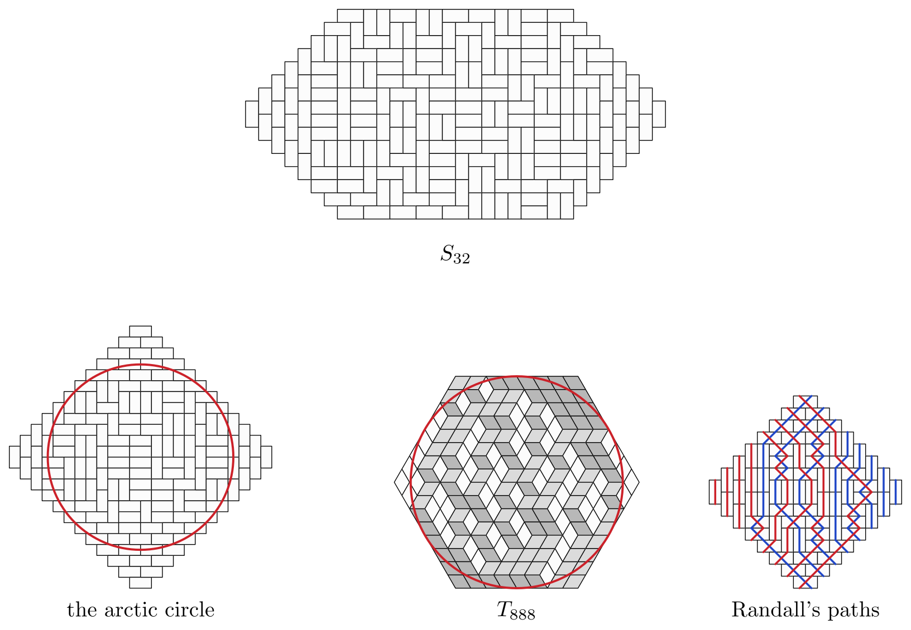

# TAOCP 7.2.2.1, Exercise 262: A Careful Reading

Written 8 September 2026, against Volume 4B, Addison-Wesley, first printing,
2022, and the errata file as of that date.

This is one reader's response to the request on Knuth's [news
page](https://www-cs-faculty.stanford.edu/~knuth/news.html): read an exercise
and its answer very carefully, then report back.

## What I found

| Item | Finding |
| --- | --- |
| Exercise 262 (statement) | No error. |
| (a) $S\_{16}$ is the Aztec diamond of order 8 | Confirmed as a shape, not only as a count. |
| (a) 68719476736 tilings of $S\_{16}$ | Confirmed; it is $2^{36}$. |
| (a) 152326556015596771390830202722034115329 for $S\_{32}$ | Confirmed, all 39 digits. |
| (a) that number is $\approx 1.552^{200}$ | Confirmed; $1.5521^{200}$. |
| (a) columnwise numbering gives linear size | Confirmed. |
| (a) rowwise numbering grows exponentially | Confirmed; $\times 1.967$ per column. |
| (a) $154440n - 2655855$ nodes for all $n \ge 30$ | Confirmed — and it already holds at $n = 29$. |
| (a) better *not* to use MRV when $n \ge 18$ | Confirmed, and 18 is exactly where it turns. |
| (a) an Aztec diamond of order $m$ has $2^{m(m+1)/2}$ tilings | Confirmed for $m \le 10$. |
| (a) an arctic circle of radius $m/\sqrt2$ | Confirmed as far as $m = 10$ can show it. |
| (a) Randall's blue and red paths | Confirmed; $m$ of each colour, never crossing their own kind. |
| **(b) the items, as printed** | **Give a problem with no tilings at all.** One bound is missing. |
| (b) $257400n - 1210061$ nodes for all $n \ge 7$ | Confirmed, and 7 is the exact threshold. |
| (b) $\Pi\_{lmn} = \prod\prod\prod (i+j+k-1)/(i+j+k-2)$ | Confirmed against the diagram's own count. |
| (b) $\Pi\_{888} = 5055160684040254910720$ | Confirmed. |
| (b) $\Pi\_{88(16)} = 2065715788914012182693991725390625$ | Confirmed. |
| (b) $(1,2,\ldots,8,7,\ldots,1)$ vertical diamonds in the 15 rows | Confirmed, for every tiling at once. |
| (b) 64 vertical diamonds in all | Confirmed; the three kinds number $lm$, $mn$, $nl$. |
| (b) and these occurrences are nested | Confirmed; consecutive rows strictly interlace. |



Everything in the answer came out, to the last digit of a 39-digit number and
to the exact place where a threshold turns, except for one line of part (b)'s
recipe, which is [section 6](#6-part-b-one-bound-short) below.

The whole verification runs in about four and a quarter minutes.

## 1. What the exercise asks

Algorithm Z, the ZDD-building form of Algorithm C, is worth having when a
family of solutions is far larger than the number of distinct subproblems
behind it. Tilings are the standard example, so exercise 262 asks how big the
diagram gets for two of them.

- **(a)** $S\_n$ is a $16 \times n$ rectangle with a right triangle of side 7 cut
  from each corner. How many ZDD nodes does Algorithm Z output for its domino
  tilings? How many tilings does $S\_{16}$ have, and $S\_{32}$?
- **(b)** $T\_n$ is a hexagon of sides $(8,8,n,8,8,n)$. How big is the diagram
  for all of its diamond tilings?

The answer settles both, and then keeps going for a page: which way the cells
must be numbered, whether the MRV heuristic earns its keep, the Aztec diamond
formula, an arctic circle, a picture of blue and red paths, MacMahon's box
formula, and the plane partition hiding inside a diamond tiling.

The program here is [`verify/verify.w`](verify/verify.w), which drives this
repository's [ZDD engine](../../zdd/zdd.w). Its shape is Knuth's general one:
$S\_{mn}$ is $2m$ rows with triangles of side $m-1$ cut off, so $S\_n$ is
$S\_{8n}$ and the Aztec diamond of order $m$ is $S\_{m(2m)}$, and one builder
serves all three.

## 2. May we compare node counts at all?

This needs saying before any number does. Algorithm Z outputs a **free** ZDD,
whose shape depends on which item step Z3 branches on; this repository's engine
hands its options to a BDD library, which reduces as it builds, so what it
returns is the **reduced ordered** ZDD for the option numbering. Those are
different objects in general.

They coincide here. Exercise 264 shows that branching on the least-numbered
active item makes Algorithm Z's output ordered, and exercise 265 that no two of
its nodes are ever equal when every item is primary — which is to say that in
that case its output *is* the reduced ordered ZDD, the one canonical object.
So the counts are comparable, provided the options are numbered the same way:
grouped by their smallest item, in the order the answer's recipe generates
them. They are, and every count below matches.

The converse is the subject of section 5.

## 3. Part (a): how many tilings

$S\_{16}$ is the Aztec diamond of order 8 — the program checks the shape, not
just the number, by confirming that row $r$ holds $2\min(r+1,2m-r)$ cells. Its
tilings come to

$$68719476736 = 2^{36},$$

which is the answer's number, and $(\sqrt2)^{72}$ as it writes it. The general
formula holds too:

| order $m$ | 1 | 2 | 3 | ... | 8 | 9 | 10 |
| --- | --- | --- | --- | --- | --- | --- | --- |
| tilings | 2 | 8 | 64 | | 68719476736 | 35184372088832 | 36028797018963968 |
| $2^{m(m+1)/2}$ | ✓ | ✓ | ✓ | ✓ | ✓ | ✓ | ✓ |

And $S\_{32}$, in ten seconds:

$$152326556015596771390830202722034115329$$

every digit of it the answer's, and its 200th root is 1.5521, so the answer's
$\approx 1.552^{200}$ is right as well.

## 4. Part (a): how big the diagram

Columnwise, the diagram is linear in $n$ and the answer's formula is exact:

| $n$ | 26 | 27 | 28 | 29 | 30 | 31 | 32 |
| --- | --- | --- | --- | --- | --- | --- | --- |
| nodes | 1359762 | 1514025 | 1668474 | 1822905 | 1977345 | 2131785 | 2286225 |
| $154440n - 2655855$ | $-177$ | ✓ | $-9$ | ✓ | ✓ | ✓ | ✓ |

The answer claims the formula "for all $n \ge 30$", and that is true. It is
also true at $n = 29$, and at the odd values 23, 25 and 27; the even values
approach from above and only settle at 30. So the stated bound is right but not
tight: **29 is where the formula starts to hold without exception.** The last
miss, at $n = 28$, is by 9 nodes out of 1668474.

Numbering the cells rowwise instead multiplies the diagram by about 1.967 for
every column added, which is the exponential growth the answer warns about:

| $n$ | 16 | 18 | 20 | 22 |
| --- | --- | --- | --- | --- |
| columnwise | 83406 | 237222 | 470390 | 751130 |
| rowwise | 83406 | 322079 | 1245811 | 4826961 |
| growth per column | | 1.965 | 1.967 | 1.968 |

At $n = 16$ the two agree, as they must: the Aztec diamond is symmetric under
transposition, so the two numberings are the same numbering.

The claim of $\Theta(n^2)$ running time is the other half of linearity. The
number of memo entries grows by a constant per column — about 117,000 with the
least-numbered rule — and a signature is a list of the still-active items, so
it is $\Theta(n)$ long. Linearly many memos, each costing linear work, is
$\Theta(n^2)$.

## 5. MRV, and a diagram that cannot notice

"Furthermore, it turns out to be better *not* to use the MRV heuristic, when
$n \ge 18$." The engine here has both rules, and the crossover is exactly where
the answer puts it:

| $n$ | 16 | 17 | **18** | 19 | 20 | 21 | 22 |
| --- | --- | --- | --- | --- | --- | --- | --- |
| memos, fewest options | 55690 | 49514 | **204771** | 316138 | 439093 | 602824 | 697063 |
| memos, least numbered | 66014 | 90801 | **189891** | 272643 | 376165 | 477247 | 580241 |
| cheaper | MRV | MRV | **least** | least | least | least | least |

Two rules, one diagram: the node counts are identical in every row of that
table. They have to be. A reduced ordered ZDD is determined by its family and
its variable order, and the branching rule is neither — so where Algorithm Z's
free output changes shape with the heuristic, ours cannot. What the heuristic
buys or costs here is time and memo-cache space, nothing else.

## 6. Part (b): one bound short

Answer 262 sets part (b) up like this:

> use items $(x,y)$ for $0 \le x < n+8$, $0 \le y < 16$, $x+y \ge 8$;
> $(x,y)'$ for $0 \le x < n+8$, $0 \le y < 16$, $7 \le x+y < n+15$.

The second clause bounds $x+y$ from both sides and cuts two opposite corners
off the $16(n+8)$-square frame, leaving a hexagon. The first bounds it only
from below, and cuts one corner. Counting what survives:

- upward triangles: $16(n+8)$ less the 36 squares with $x+y \le 7$, so $16n+92$;
- downward triangles: $16(n+8)$ less the 28 with $x+y \le 6$ and the 36 with
  $x + y \ge n+15$, so $16n+64$.

A region with more upward triangles than downward ones cannot be tiled by
diamonds at all, each of which covers one of each. Run it as printed and the
engine returns the empty family. For $n = 6$:

```text
n=6, printed:  188 up, 160 down, 0 tilings
n=6, repaired: 160 up, 160 down, 623055648083552320 tilings
```

**The missing bound is $x+y < n+16$.** It cuts the 28 squares with
$x+y \ge n+16$, and then both counts come to $16n+64$ — which is $lm+mn+nl$
with $(l,m,n) = (8,8,n)$, the number of triangles of each orientation that a
hexagon of sides $(8,8,n,8,8,n)$ has. With it in place everything else in the
answer follows.

The two clauses are so nearly parallel that this looks like a line of type that
lost half of itself. Nothing downstream depends on it: the numbers the answer
goes on to give are all correct.

## 7. Part (b): the size, and MacMahon's product

With the bound restored, the answer's second formula is exact from $n = 7$, and
7 is the exact threshold:

| $n$ | 5 | 6 | **7** | 8 | 9 | 10 | 16 |
| --- | --- | --- | --- | --- | --- | --- | --- |
| nodes | 180900 | 350784 | **591739** | 849139 | 1106539 | 1363939 | 2908339 |
| $257400n - 1210061$ | $-103961$ | $-16445$ | **✓** | ✓ | ✓ | ✓ | ✓ |

The counts match MacMahon's box formula
$\Pi\_{lmn} = \prod\prod\prod (i+j+k-1)/(i+j+k-2)$ at every one of them, and
the two products the answer names come out:

$$\Pi\_{888} = 5055160684040254910720,$$

$$\Pi\_{88(16)} = 2065715788914012182693991725390625.$$

Numbering the triangles the other way — by $y$ and then $x$, across the hexagon
rather than along it — starts out *smaller*, which surprised me, but it is not
linear: it roughly quadruples where the answer's numbering adds a constant, and
it has overtaken by $n = 9$ (1633195 nodes against 1106539).

## 8. Diamonds by kind, and by row

"Therefore every tiling of $T\_n$ has respectively $(1,2,\ldots,8,7,\ldots,1)$
vertical diamonds in rows $(1,2,\ldots,15)$, hence 64 in all; and these
occurrences are nested."

These are statements about *every* tiling at once, which is where a diagram
earns its keep. Asking the ZDD for the heaviest solution under a weight of 1 on
the diamonds of one kind gives the largest number any tiling has; asking again
with the weights negated gives the smallest. Both are single walks over the
DAG, and when they agree the count is forced. They agree everywhere:

| hexagon | leaning one way | upright | leaning the other |
| --- | --- | --- | --- |
| $T\_{8,8,2}$ | 16 | **64** | 16 |
| $T\_{3,4,5}$ | 15 | 12 | 20 |
| $T\_{8,8,8}$ | 64 | **64** | 64 |

which is $nl$, $lm$, $mn$ — so for $l = m = 8$ the upright ones always number
64, whatever $n$ is. Row by row, over rows 1 to 15 and for every $n$ tried:

```text
1 2 3 4 5 6 7 8 7 6 5 4 3 2 1
```

exactly the answer's sequence, and forced in every row separately.

"Nested" means interlaced. An upright diamond of row $y$ stands at $2x + y$
along that row, and the positions in one row fall strictly between those in the
next, the longer row surrounding the shorter — which is precisely the
condition that turns a tiling into a plane partition. Checked on every one of
the 20 tilings of $T\_{2,2,2}$, every one of the 175 of $T\_{3,3,2}$, and a
thousand tilings of $T\_{8,8,4}$ drawn uniformly at random from the diagram: no
exceptions.

## 9. Randall's paths

Part (a) of the answer ends with a picture and a caption: "every vertical
domino has either a blue or red path; every horizontal domino has blue and red
paths, crossed." That is enough to reconstruct the drawing. Colour the cells
like a chessboard and put a node at the midpoint of every horizontal grid edge.
Then a vertical domino carries one straight segment from the node above it to
the node below it, and a horizontal domino carries two — blue running from the
top of its black cell down to the bottom of its white one, red the other way,
so that they cross.

Nothing else is free, and what has to be checked is that the pieces join up:
that no node has two segments arriving or two leaving, that no segment joins a
blue node to a red one, and that every path so formed runs from the top of the
region to the bottom rather than doubling back. Over 200 random tilings each of
the Aztec diamonds of orders 4, 6 and 8, there were no faults, and the number of
paths came out at $m$ blue and $m$ red every time. The rightmost panel of the
picture above is one of them.

## 10. The arctic circle

"As $m \to \infty$, the dominoes at the corners are q.s. aligned, except within
an 'arctic circle' of radius $m/\sqrt2$."

Sampling would show this, but the diagram can do better than sample. The
tilings that use a given domino are the quotient of the family by that element,
so counting them is one more walk over the DAG, and the chance $p$ that a
particular cell is covered lengthwise comes out *exactly*. Write $|2p-1|$ for
how far that cell is from undecided — 0 when the two orientations are equally
likely, 1 when the cell is frozen — and average it over the cells at each
radius:

| $r/m$ | .0 | .1 | .2 | .3 | .4 | .5 | .6 | .7 | .8 | .9 |
| --- | --- | --- | --- | --- | --- | --- | --- | --- | --- | --- |
| $m=6$ | | .00 | .06 | .00 | .02 | .21 | .47 | .64 | | .97 |
| $m=8$ | .00 | .00 | .00 | .09 | .04 | .16 | .44 | .58 | .93 | .99 |
| $m=10$ | .00 | .02 | .01 | .09 | .09 | .11 | .44 | .71 | .98 | 1.00 |

The climb from undecided to frozen straddles $r/m = 0.7071 = 1/\sqrt2$, and it
gets steeper as $m$ grows. The left panel of the picture above draws the circle
on a random tiling of the Aztec diamond of order 12; the four frozen corners
outside it are plain to the eye.

Nothing here is exactly frozen, and that is worth saying plainly: at these
sizes no domino appears in every tiling, so "frozen" is the asymptotic
statement it says it is, and 10 is a small number to be watching an asymptote
with. What the table shows is a transition in the right place, sharpening in
the right direction.

## What is in this directory

| File | |
| --- | --- |
| [`verify/verify.w`](verify/verify.w) | the program, as a literate document |
| [`verify/verify.pdf`](verify/verify.pdf) | the same, typeset |
| [`verify/tilings.mp`](verify/tilings.mp) | the picture, in MetaPost |
