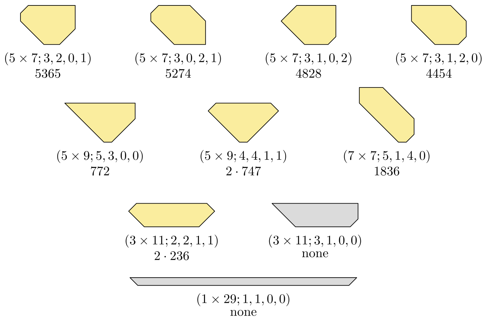

# TAOCP 7.2.2.1, Exercise 320: A Careful Reading

Written 5 September 2026, against Volume 4B, Addison-Wesley, first printing,
2022, and the errata file as of that date.

This is one reader's response to the request on Knuth's [news
page](https://www-cs-faculty.stanford.edu/~knuth/news.html): read an exercise
and its answer very carefully, then report back.

## What I found

| Item | Finding |
| --- | --- |
| Exercise 320 (statement) | No error. |
| Answer 320, the six parameters | Confirmed against brute force, $N \le 11$. |
| Answer 320, smallest sizes $2m(n-m)$ and $2n-1$ | Confirmed, $m \le 12$. |
| Answer 320, "63 solutions when $N = 56$" | **63**, and all really convex. |
| Answer 320, five odd tetraboloes | **E, G, J, K, L**, letters and all. |
| Answer 320, "just 10 of the 63 pass" | Exactly those ten. |
| Answer 320, the two that don't work | Both come out **0**. |
| Answer 320, the eight packing counts | All eight, on the nose. |
| Wang and Hsiung, 20 convex 16-aboloes | **20**. |

Every number came out exactly. Nothing in the exercise or the answer needs
correcting.



The whole verification runs in 24 seconds, which is worth saying because the
work is not in the searching. It is in getting the *grid* right: polyaboloes
live on a grid that is not a partition of the plane, and answer 319 shows the
way around that. Section 2 sets it up, and everything after it is easy.

## 1. What the exercise asks

A polyabolo is made of isosceles right triangles glued edge to edge, the
triangle being half of a unit cell of the square grid. Exercise 320 asks two
things:

- how to enumerate the convex $N$-aboloes; and
- how many of the convex 56-aboloes the fourteen tetraboloes can pack.

Fourteen tetraboloes at four halfsquares each is 56, so the second question is
a family of exact cover problems, one per convex 56-abolo — as soon as the
first question says what those are.

## 2. The grid, and why quarters

A unit cell can be cut along either diagonal, so it offers four halfsquares,
and two of them may overlap: the lower left half and the lower right half share
the south quarter. That is fatal for an exact cover model, where a placement
has to be a *set of items*.

Answer 319 supplies the fix, and it is worth restating because everything here
rests on it. Cut every cell at **both** diagonals, into four quarters. Then a
halfsquare is exactly two adjacent quarters, distinct halfsquares of a cell
are disjoint or not according to whether they share a quarter, and a packing is
an exact cover of quarters. Answer 319 phrases this as a correspondence with
2n-ominoes on the H-grid; I use the quarters directly, since the symmetries are
simpler to write in cell coordinates than in H-grid pixels.

I number the quarters 0, 1, 2, 3 for south, east, north, west, and number a
halfsquare $t$ so that it owns quarters $t$ and $t-1$: 0 is the lower left
half, 1 the lower right, 2 the upper right, 3 the upper left. Halves 0 and 2
are the two sides of the `\` diagonal, halves 1 and 3 of the `/` diagonal. In
these coordinates the eight symmetries of the grid are one-liners: a quarter
turn sends cell $(x,y)$ to $(-y-1, x)$ and advances the quarter, and a
reflection in the vertical axis sends it to $(-x-1, y)$ and swaps east with
west — which on halves is a single bit flip.

The check that this is all right is the polyabolo census itself: 1, 3, 4, 14,
30, 107, 318, 1116, 3743, 13240, 46476 for $N = 1$ to 11, so the three
diaboloes and the fourteen tetraboloes the exercise names come out of the
growth, not out of a table.

## 3. The six parameters

Answer 320's characterization: a convex polyabolo is an $m \times n$
rectangle — $n$ wide, $m$ tall — with right triangles of legs $a$, $b$, $c$,
$d$ cut from the lower left, lower right, upper right and upper left corners,
where

$$
a + b \le n, \quad b + c \le m, \quad c + d \le n, \quad d + a \le m,
$$

and then $N = 2mn - a^2 - b^2 - c^2 - d^2$. Duplicates are avoided by asking
for $m \le n$ and for $(a,b,c,d)$ to be lexicographically largest among the
tuples the rectangle's own symmetries produce — three rivals in general, seven
when the rectangle is a square.

This is right, and I did not want to take it on faith, because it is the part
of the answer that a reader is most likely to accept without checking.

## 4. Growing every polyabolo

So the program grows every polyabolo up to size 11, one triangle at a time,
reducing by the eight symmetries, and asks of each whether it is convex. The
convexity test knows nothing about rectangles and corner cuts: it takes the
convex hull of the shape's corners and asks whether the shape holds every
halfsquare whose centroid falls inside — that is, whether the shape is all of
its own hull.

| $N$ | polyaboloes | convex | by the six parameters |
| --- | --- | --- | --- |
| 1 | 1 | 1 | 1 |
| 2 | 3 | 3 | 3 |
| 3 | 4 | 2 | 2 |
| 4 | 14 | 6 | 6 |
| 5 | 30 | 3 | 3 |
| 6 | 107 | 7 | 7 |
| 7 | 318 | 5 | 5 |
| 8 | 1116 | 11 | 11 |
| 9 | 3743 | 5 | 5 |
| 10 | 13240 | 10 | 10 |
| 11 | 46476 | 7 | 7 |

Every line agrees, which says both that the parameters miss nothing and that
the canonical form counts nothing twice. The sequence of convex counts
continues 14, 7, 16, 11, **20**, 9, 17, 13, 22, ... and that 20 at $N = 16$ is
the number Wang and Hsiung proved by hand in 1942, which the answer cites. (It
is OEIS A245676; I could not reach the OEIS from here, so the check is against
Wang and Hsiung's number and against my own growth, not against the b-file.)

## 5. The bound

The answer's argument for finiteness is that the smallest positive size is
$2m(n-m)$ when $m < n$ and $2n-1$ when $m = n$, so $n \le (N+2)/2$. Trying
every set of cuts for $1 \le m \le 12$ and $m \le n \le 24$ gives those two
minima with no disagreements. So the loop over $m$ and $n$ can stop where the
program stops it.

## 6. The 63

For $N = 56$ the parametrization yields **63** shapes, matching the answer.
Each one is also put through the hull test of section 4 and checked to have
exactly 56 halfsquares, and the 63 are pairwise distinct as regions. Same for
$N = 20$, 30 and 40, with no failures.

## 7. O'Beirne's parity, and which five

Now the pretty part. Answer 320 says that exactly five tetraboloes, namely
$\lbrace E, G, J, K, L\rbrace$, "have an odd number of unmatched $\sqrt2$
sides in each direction", and concludes that $a + c$ and $b + d$ must be odd.

A halfsquare's hypotenuse is its cell's diagonal, and it is unmatched when the
other half of that cell is not in the piece. Counting those for each of the
fourteen pieces gives five odd ones. Two things are worth spelling out:

- **Why "in each direction" is one condition and not two.** A quarter turn
  sends halves of one kind to the other, so the two counts trade places; and
  they sum to 4. Hence they always have the same parity, and oddness is a
  property of the free piece, not of how it is turned.
- **Why $a + c$ and $b + d$.** Inside a packing the $\sqrt2$ edges match in
  pairs, so the number of unmatched `\` sides summed over the fourteen pieces
  has the parity of the number of `\` sides on the region's boundary. Five
  pieces are odd, so that boundary count is odd. The `\` part of a convex
  region's boundary is the lower left cut and the upper right one, of lengths
  $a$ and $c$; the `/` part is $b$ and $d$.

The letters are the one thing here that cannot be computed, since they come
from the figure in exercise 319. I recovered them by reading that figure back:
rendering the page, cutting it into the fourteen coloured blobs, and matching
each blob to one of my fourteen shapes by moment invariants, which ignore
position, size, turning and mirroring. The matching is a perfect pairing with
no clashes, and the five odd pieces under it are **E, G, J, K, L** — exactly
what the answer says. The piece table in `verify/verify.w` records the result,
so the program can check that its own fourteen and the book's fourteen are the
same set.

## 8. The ten survivors, and their packings

Of the 63, exactly ten have $a + c$ and $b + d$ both odd, and they are the ten
the answer lists. The exact cover problem then has one item per quarter (112 of
them) and one per piece (14), with about 1100 options:

| Shape | Options | Solutions | Answer 320 |
| --- | --- | --- | --- |
| $(1\times29; 1,1,0,0)$ | 130 | **0** | doesn't work |
| $(3\times11; 3,1,0,0)$ | 1052 | **0** | doesn't work |
| $(3\times11; 2,2,1,1)$ | 1054 | **472** | $2 \cdot 236$ |
| $(5\times7; 3,0,2,1)$ | 1190 | **5274** | 5274 |
| $(5\times7; 3,1,0,2)$ | 1201 | **4828** | 4828 |
| $(5\times7; 3,1,2,0)$ | 1189 | **4454** | 4454 |
| $(5\times7; 3,2,0,1)$ | 1190 | **5365** | 5365 |
| $(5\times9; 4,4,1,1)$ | 1105 | **1494** | $2 \cdot 747$ |
| $(5\times9; 5,3,0,0)$ | 1103 | **772** | 772 |
| $(7\times7; 5,1,4,0)$ | 1084 | **1836** | 1836 |

All ten in 6.4 seconds together.

The two counts the answer writes as doubles are explained by the shapes
themselves. The program also counts each region's own symmetries, and finds
that exactly two of the ten — $(3\times11; 2,2,1,1)$ and $(5\times9; 4,4,1,1)$,
the two whose corner tuple is fixed by a reflection — have a symmetry besides
the identity. Those are precisely the two written as $2 \cdot 236$ and
$2 \cdot 747$: every packing has a mirror image that is a different packing, so
the total is even and the answer prints the half.

## 9. What I checked before reporting this

- The polyabolo counts 1, 3, 4, 14, 30, 107, 318, 1116, 3743, 13240, 46476
  match the known sequence, so the grid, the adjacency and the symmetry
  reduction are right before anything is built on them.
- Every one of the 63 shapes passes an independent convexity test and has
  exactly 56 halfsquares, and no two of them are the same region.
- The fourteen pieces read off the book's figure are exactly the fourteen the
  growth produces — same canonical forms, a perfect pairing.
- The two minima that justify the search bound hold over a range far wider
  than the exercise needs.
- The packing model covers *quarters*, not halfsquares, so a cell cut two
  ways cannot be double-covered; the option counts and the solution counts
  both come out as the answer says.

## 10. Running it

```text
make                            # tangles and builds
cd taocp-7.2.2.1-exercises/320/verify && go run verify.go
```

| Mode | What it does | Time |
| --- | --- | --- |
| `-mode census -upto 11` | section 4 | 18 s |
| `-mode pieces` | sections 7 | instant |
| `-mode bound` | section 5 | instant |
| `-mode convex -N 56` | sections 3 and 6 | instant |
| `-mode pack -N 56` | section 8 | 6.4 s |
| `-mode all` (the default) | all of it | 24 s |

## Sources

- D. E. Knuth, *The Art of Computer Programming*, Volume 4B, §7.2.2.1,
  exercises 319 and 320 and their answers.
- T. H. O'Beirne, *New Scientist* **13** (18 January 1962), 158-159, where
  polyaboloes and the parity argument were introduced.
- F. T. Wang and C.-C. Hsiung, *American Mathematical Monthly* **49** (1942),
  596-599, for the 20 convex 16-aboloes.
