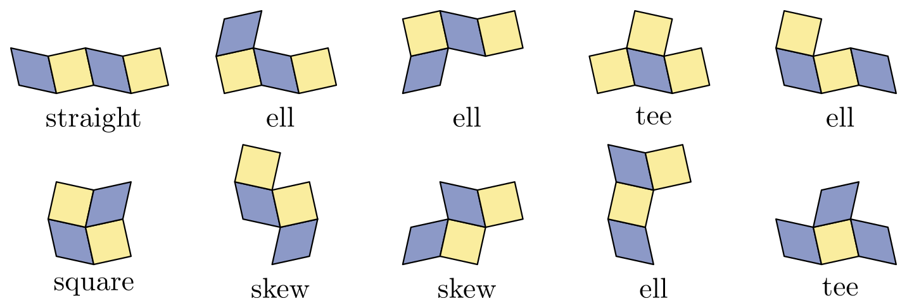

# TAOCP 7.2.2.1, Exercise 323: A Careful Reading

Written 5 September 2026, against Volume 4B, Addison-Wesley, first printing,
2022, and the errata file as of that date.

This is one reader's response to the request on Knuth's [news
page](https://www-cs-faculty.stanford.edu/~knuth/news.html): read an exercise
and its answer very carefully, then report back.

## What I found

| Item | Finding |
| --- | --- |
| Exercise 323 (statement) | No error. |
| 2 monoskews, 1 diskew, 5 triskews, 10 tetraskews | All four confirmed. |
| Answer 323(a), the skewing formula | Works; the checkerboard follows. |
| Answer 323(b), crosses and diagonals | Reproduces 486 and 572 exactly. |
| Answer 323(c), the 4×10 frame: 486 | **486**, two independent ways. |
| Answer 323(c), the 5×8 frame: 572 | **572**, likewise. |
| Answer 323(c), "2 × 20 is too tight" | **0**. |
| Answer 323(c), the 2×21 frame: 3648 | **72**; 3648 is the 2×22 count. |
| Answer 323(c), solutions come in pairs | Confirmed; none is self-dual. |
| Answer 323(c), 226 arrangements, 17 doubled | **226** and **17**. |
| Answer 323(c), the tetromino multiset | Confirmed, and see section 4. |
| Keller's two 4×5 frames: 24 | **48** solutions = 24 dual pairs. |

One number is wrong, and it is a frame size rather than a count: the 3648 the
answer attributes to a 2×21 frame is the number of ways to fit the ten
tetraskews into a **2×22** frame. A 2×21 frame has 72.



The whole verification runs in about six seconds.

## 1. What the exercise asks

Polyskews are the shapes you get "when we join squares alternately with
rhombuses, in checkerboard fashion". The exercise says there are two monoskews,
one diskew, five triskews and ten tetraskews, and asks

- (a) how to draw such skewed diagrams,
- (b) how to reduce polyskews to polyominoes, as answer 319 does for
  polyaboloes, and
- (c) in how many ways the ten tetraskews make a skewed rectangle.

Ten tetraskews of four cells each is forty cells, so (c) is a family of exact
cover problems — as soon as the grid is pinned down, which is what (a) is for.

## 2. The grid, from the formula of part (a)

Answer 323(a) offers the coordinates: skew the vertices $(m,n)$ of the square
grid to

$$
(m,n) \mapsto (m - \epsilon[n \text{ odd}],\; n - \epsilon[m \text{ odd}]).
$$

Everything else follows from working out what that does to a cell. Cell $(x,y)$
has corners $(x,y)$, $(x+1,y)$, $(x+1,y+1)$, $(x,y+1)$, and after the skew its
two edge vectors are $(1, \pm\epsilon)$ and $(\mp\epsilon, 1)$. Their dot
product is $\pm 2\epsilon$ when $x+y$ is even and $0$ when it is odd. So:

- $x+y$ odd — the cell is a **square**;
- $x+y$ even — the cell is a **rhombus**;

which is the checkerboard the exercise describes. The finer structure matters
too, and the answer points at it: "each square of the skewed grid has a
clockwise or counterclockwise spin". Reading off the edge vectors,

- at $(x,y)$ both even the rhombus is stretched along $(1,-1)$, at both odd
  along $(1,1)$;
- the square spins counterclockwise when $x$ is odd and $y$ even, clockwise the
  other way round.

So a cell's whole character is fixed by $(x \bmod 2, y \bmod 2)$, and that is
the only thing the program needs to know about the drawing.

## 3. Which motions are allowed

This is the part that has to be got right before any count means anything. A
polyskew may be turned and flipped, but only in ways that carry the skewed grid
to itself. The linear part is one of the eight symmetries of the square, and
shifts by $(2,0)$ and $(0,2)$ are harmless, so the question is which shift
modulo 2 goes with each linear map. Testing all $8 \times 4$ candidates against
the four kinds of cell leaves **eight**: the full dihedral group, each map
carrying its own shift.

Two consequences are worth stating because they are easy to get backwards.

- A plain shift by $(1,1)$ is *not* a symmetry. It turns every lean and every
  spin around. That is exactly the answer's "changing the spins", and it is
  what makes the *dual* of a solution.
- A reflection *is* a symmetry, but only paired with the right odd shift. So
  the grid is not chiral, and the ten tetraskews are the free ones.

With that group, growing the shapes one cell at a time gives **2, 1, 5, 10**
for one through four cells — the numbers the exercise states, out of the growth
rather than out of a table.

## 4. The dual, and the tetromino types

Sliding a shape by $(1,1)$ is an involution on the ten tetraskews. It fixes
**four** of them and swaps the other **six** in three pairs — which is answer
323's "$K \leftrightarrow L$, $S \leftrightarrow Z$, $U \leftrightarrow V$ are
swapped", with the other four left alone.

That also recovers the multiset the answer names. Forget the skew and a
tetraskew becomes a tetromino; the dual fixes a piece exactly when the piece is
achiral, so the four fixed ones are the straight, the square and the two tees,
and the six swapped ones are the two skews and the four ells:

> one square, one straight, two skews, two tees, and four ells

confirmed, and visible in the figure above.

## 5. The frames

The exact cover problem has one item per cell and one per piece. Where a frame
has more than forty cells, the extra ones are left empty by a single item of
multiplicity $h$ — one item, not $h$ of them, so that a set of empty cells is
counted once rather than once per ordering. That is what the MCC engine is for,
and it matters here: with four separate hole items the 2×22 count comes out
$4! / (2!\,2!) \cdot$ too big, at 14,592 instead of 3648.

| Frame | Cells | Empty | Options | Solutions | Answer 323 |
| --- | --- | --- | --- | --- | --- |
| 4 × 10 | 40 | 0 | 401 | **486** | 486 |
| 5 × 8 | 40 | 0 | 429 | **572** | 572 |
| 2 × 20 | 40 | 0 | 197 | **0** | "too tight" |
| 2 × 21 | 42 | 2 | 250 | **72** | 3648 |
| 2 × 22 | 44 | 4 | 263 | **3648** | — |
| two 4 × 5 | 40 | 0 | 322 | **48** | 24 dual pairs |

Keller's problem comes out at 48, which is 24 dual pairs — the answer quotes
the halved figure, as it does throughout that paragraph.

## 6. The 2 × 21 frame

The one number that does not match. The 2×21 frame holds 42 cells, the ten
pieces cover 40, so two cells are left empty; there are 72 ways. The 3648 the
answer gives is the count for a **2 × 22** frame, which holds 44 cells and
leaves four empty. So the frame size in that sentence looks to be off by one.

Things I checked before saying so:

- All four parity offsets of a 2×21 frame give 72, so it is not a question of
  where the frame sits in the grid.
- Staggered two-row strips of 42 cells give 0 or 72, never 3648.
- The placements were counted a second way — every four cells of the frame
  whose canonical form is one of the ten pieces — and the two counts agree, for
  the 2×21 frame as well as for the 4×10 one.
- The pixel model of section 7, which knows nothing about the cell coordinates
  or the symmetry bookkeeping, also gives 72 for the 2×21 frame.

The reading is also self-consistent in the other direction: "2 × 20 is too
tight" is right in my numbering (40 cells, 0 solutions), and would be wrong if
the frames were being counted a column larger.

## 7. The reduction of part (b)

Part (b) asks for polyskews to be reduced to polyominoes. Answer 323(b) does it
with a picture: a square becomes a five-pixel cross and a rhombus a three-pixel
diagonal, leaning the way the rhombus leans. Cell $(x,y)$ sits at pixel
$(2x, 2y)$, and the crosses and diagonals tile the pixel plane exactly — four
pixels per cell on average, $5$ and $3$ alternating.

The claim worth testing is the parenthetical one: "The shapes fit together only
when squares and rhombuses alternate properly." In the pixel world an ordinary
polyomino solver is free to shift a piece by one pixel, which in the cell world
would be nonsense. Does the interlocking prevent it?

It does. Running the pixel model with every shift allowed:

| Frame | Options | Solutions |
| --- | --- | --- |
| 4 × 10 | 3113 | **486** |
| 5 × 8 | 3884 | **572** |
| 2 × 21 | 782 | **72** |

The same numbers as the cell model, from a solver that was never told about the
alternation. So the reduction is sound, and section 6's 72 has been reached
twice by quite different routes.

## 8. The duality, and the 226

Answer 323 says the counts "can be divided by 2, because solutions to this
problem come in pairs". The dual of a solution is the $(1,1)$ slide followed by
whichever symmetry of the grid brings the frame back onto itself, with each
piece relabelled by its own dual. For both rectangles:

- every dual of a solution is again a solution of the same frame;
- **no solution is its own dual**.

So the pairing is a fixed-point-free involution and the counts are even:
$486 = 2 \cdot 243$ and $572 = 2 \cdot 286$.

Forgetting which piece is which leaves the *unskewed arrangement* — the
partition of the rectangle into ten tetrominoes. Grouping the solutions by
that, up to the four reflections of the rectangle:

| Frame | Arrangements | Yielding two solutions | Yielding four |
| --- | --- | --- | --- |
| 4 × 10 | **226** | 209 | **17** |
| 5 × 8 | 265 | 244 | 21 |

which is the answer's "exactly 226 unskewed arrangements that are distinct
under reflections, 17 of which actually yield two dual pairs of skewed
solutions". And $209 \cdot 2 + 17 \cdot 4 = 486$, as it must.

## 9. The same numbers from the other end

The last check turns the problem around. Answer 323 says an arrangement of ten
unskewed tetrominoes with the right multiset

> can be skewed in four ways, because we have two choices for which cells
> should be rhombuses and two choices for the spins; and it will be a valid
> skewed solution if and only if the resulting ten tetraskews are distinct.

The four ways are the four places the rectangle can sit in the grid, modulo 2
in each direction. So: enumerate the arrangements — an MCC problem, with the
tetromino types carrying multiplicities 1, 1, 2, 2, 4 — skew each of them four
ways, and keep the ones whose ten pieces come out distinct.

| Frame | Arrangements | Valid at each of the four offsets |
| --- | --- | --- |
| 4 × 10 | 5164 | **486**, 486, 486, 486 |
| 5 × 8 | 10368 | **572**, 572, 572, 572 |

The counts of section 5 recovered from a direction that never packs a skewed
piece at all. The structure comes out too:

- no arrangement is valid at one or three offsets — only at 0, 2 or 4, so
  solutions really do come in pairs;
- when exactly two work they are always a *dual* pair, differing by $(1,1)$;
  not one exception in either rectangle;
- when four work, both choices of which cells are rhombuses work, which is the
  answer's "two dual pairs of skewed solutions, in which the roles of squares
  and rhombuses are reversed".

And the counts line up with section 8: for the 4×10 rectangle, 68 arrangements
have all four valid and 836 have two, which is $4 \cdot 17$ and $4 \cdot 209$ —
the labelled arrangements being four to a reflection class.

## 10. Running it

```text
make                            # tangles and builds
cd taocp-7.2.2.1-exercises/323/verify && go run verify.go
```

| Mode | What it does | Time |
| --- | --- | --- |
| `-mode pieces` | sections 3 and 4 | instant |
| `-mode pack` | sections 5 and 6 | 0.5 s |
| `-mode dual` | section 8 | 0.2 s |
| `-mode pixel` | section 7 | 0.4 s |
| `-mode tilings` | section 9 | 5 s |
| `-mode all` (the default) | all of it | 6 s |

## Sources

- D. E. Knuth, *The Art of Computer Programming*, Volume 4B, §7.2.2.1,
  exercise 323 and its answer.
- Michael Keller, *World Game Review* **12** (1994), 12, where the polyskews
  were named and the two-frame packing was found.
