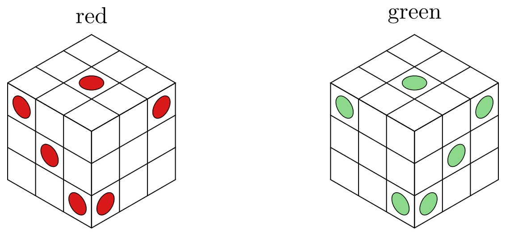

# TAOCP 7.2.2.1, Exercise 337: A Careful Reading

Written 5 September 2026, against Volume 4B, Addison-Wesley, first printing,
2022, and the errata file as of that date.

This is one reader's response to the request on Knuth's [news
page](https://www-cs-faculty.stanford.edu/~knuth/news.html): read an exercise
and its answer very carefully, then report back.

## What I found

| Item | Finding |
| --- | --- |
| Exercise 337 (statement) | No error. |
| Answer 337, the two spot lists | Genuine dice, and mirror images. |
| Answer 337, "16 ways to put spots on dice" | **16**, exactly. |
| Answer 337, 5328 packings | **5328**. |
| Answer 337, 111 classes of size 48 | **111**, every one of size 48. |
| Answer 337, fourteen faces, two inner | Confirmed; the inner two never show. |
| Answer 337, "from 2 to 7 of the 12" | **2 to 7**, and so 21 + 33 + 54. |
| Answer 337, 371 of the 5328 | **371**. |
| Answer 337, "one case leads to 6048" | **6048**, and that is the maximum. |
| Answer 337, 52 combinations, 18 faces free | **52**, and 18 is the maximum. |
| Answer 337, the printed example | 21 red spots and 21 green. |

Every number in the answer came out. The one thing a reader has to supply is a
convention: the coordinates alone do not say which of the two dice is the
left-handed one. Section 6 works that through; the answer's own picture settles
it, and settles it in favour of what the exercise says.



The whole verification runs in about two and a half minutes.

## 1. What the exercise asks

Nine bent tricubes, their square faces blank or carrying a red or a green spot,
are to assemble into a 3 × 3 × 3 cube in two ways:

- (i) no green spots visible, and the red spots matching a left-handed die;
- (ii) no red spots visible, and the green spots matching a right-handed die.

Answer 337 designs such a puzzle, and the design is the interesting part: it
takes a packing, paints its outside with the red die, and then asks whether
those same nine painted pieces can be rearranged to show the green one.

## 2. The pieces, and the cube

A bent tricube is three cubies in an L. Of its 18 cubie faces four are glued
away, leaving **14** — the answer's number. Two of those look into the notch of
its 2 × 2 × 1 block, and in a packed cube that notch is filled by another
piece, so those two can never show. I checked that directly: over all 288 ways
a piece can sit in the cube, an inner face is visible **not once**. So each
piece has 12 faces that might be seen.

Packing the cube is then one exact cover problem, with the 27 cells as items
and one option per set of three cells a piece can fill. The pieces are
identical until they are painted, so there are no piece items and each solution
is a partition of the cube, counted once:

| | Answer 337 | Here |
| --- | --- | --- |
| packings | 5328 | **5328** |
| classes, up to rotation and reflection | 111 of size 48 | **111**, all of 48 |

Every packing has a trivial stabilizer, which is why all the classes have the
full 48 members.

## 3. What an assembly fixes

| | Answer 337 | Here |
| --- | --- | --- |
| faces a piece shows | 2 to 7 | **2 to 7** |
| faces shown per packing | — | **54**, always |
| specified red | 21 | **21** |
| specified blank | 33 | **33** |
| still free | 54 | **54** |

The accounting: nine pieces at 12 faces each is 108; a packing shows 54 of
them; the die has 21 spots, so 21 come out red and the other 33 must be blank,
since goal (i) allows nothing else to be seen. That leaves 108 − 54 = 54 free.

## 4. Rearranging into green

Given the marks a red solution leaves, a green assembly must satisfy two
conditions, and it is worth stating them because they are what makes the puzzle
work:

- **no red face may show**, since goal (ii) allows no red;
- **every green spot must land on a face that is still free** — a face the red
  assembly already painted blank cannot be given a spot now.

That is an exact cover problem again, but this time the pieces are
distinguishable, so it has nine piece items as well as the 27 cells.

| | Answer 337 | Here |
| --- | --- | --- |
| red solutions that can be rearranged | 371 | **371** |
| the most green solutions from one | 6048 | **6048** |
| red + green pairs altogether | — | 185,828 |

## 5. The 52 combinations

A red solution and a green one specify 54 faces each, out of 108. A face
specified by both must be blank in both — a red face is hidden in the green
assembly, and a green spot has to go on a face the red assembly left free — so

$$
\text{faces left unspecified} = 108 - |R \cup G| = |R \cap G| .
$$

Over all 185,828 pairs the overlap takes only three values:

| Faces left unspecified | Pairs |
| --- | --- |
| 12 | 111,728 |
| 15 | 74,048 |
| **18** | **52** |

So 18 is the most that can be left free, and **52** combinations achieve it —
the answer's number, and the picture it prints is one of them. Counting the
coloured blobs in that picture gives 21 red spots and 21 green, which is what a
valid combination must have.

## 6. Which die is left-handed

This is the one place where the answer leaves something to the reader, and it
is worth spelling out because it is easy to get backwards.

Both spot lists are genuine dice. Each side carries the usual pattern for its
number of pips — the 3 and the 2 on diagonals, the 6 in two columns, the 5 a
quincunx — and opposite sides add to seven:

| | red | green |
| --- | --- | --- |
| $x=0$ | 3 | 2 |
| $x=6$ | 4 | 5 |
| $y=0$ | 2 | 3 |
| $y=6$ | 5 | 4 |
| $z=0$ | 1 | 1 |
| $z=6$ | 6 | 6 |

The green die is the red one with 2 and 3 exchanged and 4 and 5 exchanged,
which is exactly what a mirror does. So one is left-handed and the other
right-handed, and the puzzle is sound either way round.

But *which* is which does not follow from the coordinates. A die is usually
called right-handed when 1, 2 and 3 run counterclockwise about the corner they
share, seen from outside. Taking the outward normals of those three sides as
the rows of a matrix, the determinant is $+1$ for red and $-1$ for green — so
if $(x,y,z)$ is read as a right-handed frame, red is the *right*-handed die,
which is the opposite of what the exercise says.

The answer's picture settles it. It draws the red die with 1 on top, 3 at the
front left and 2 at the right, so 1, 2, 3 run clockwise and the red die is
left-handed, exactly as the exercise says. The frame of the coordinates is
therefore meant to be left-handed, and the figure above is drawn to match.

None of the counts depend on this: reflecting everything carries red solutions
to red solutions, so 5328, 371, 6048 and 52 come out the same either way. Only
the labels (i) and (ii) would swap. It is the same small gap as in answer
146(b), where an array of coordinates names a chiral cube only once one says
how it sits in space.

## 7. Sixteen ways to spot a die

The answer adds, parenthetically, "there are 16 ways to put spots on dice, not
just two". That checks out, and the factors are pleasant: 2 for the handedness,
2 for which diagonal the 2 lies on, 2 for the 3, and 2 for whether the 6 is
drawn in columns or in rows. Enumerating all 384 spotted dice and reducing by
the 24 rotations gives **16** classes, every die having a trivial stabilizer so
that $384/24$ is exact.

## 8. What I checked before reporting this

- The bent tricube's 14 faces, its two inner ones, and the fact that no inner
  face shows in any of the 288 placements.
- 5328 packings, and 111 classes of exactly 48 — the class sizes are not
  assumed, they come out of the stabilizer count.
- Both spot lists as dice: pip patterns, opposite sums, and the mirror
  relation between them.
- The three numbers 371, 6048 and 52 are what pin down the reading of the
  puzzle. If I had the conditions of section 4 wrong — say by letting a green
  spot land on a face already painted blank — none of them could come out.
- The printed example: 21 red spots and 21 green, counted off the page.

## 9. Running it

[`verify.pdf`](verify/verify.pdf)

```text
make                            # tangles and builds
cd taocp-7.2.2.1-exercises/337/verify && go run verify.go
```

| Mode | What it does | Time |
| --- | --- | --- |
| `-mode pack` | section 2 | 20 s |
| `-mode die` | sections 6 and 7 | instant |
| `-mode faces` | sections 2 and 3 | 20 s |
| `-mode twice` | sections 4 and 5 | 2 min |
| `-mode all` (the default) | all of it | 2.5 min |

The `twice` mode takes `-lo` and `-hi` to work on a range of the red solutions,
which is how it was run while the rest was being written.

## Sources

- D. E. Knuth, *The Art of Computer Programming*, Volume 4B, §7.2.2.1,
  exercise 337 and its answer.
- Angus Lavery's "Twice Dice", produced by Pentangle Puzzles in 1990.
