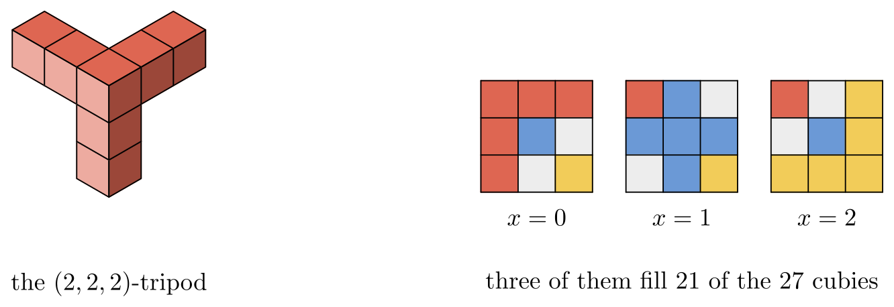

# TAOCP 7.2.2.1, Exercise 346: A Careful Reading

Written 6 September 2026, against Volume 4B, Addison-Wesley, first printing,
2022, and the errata file as of that date.

This is one reader's response to the request on Knuth's [news
page](https://www-cs-faculty.stanford.edu/~knuth/news.html): read an exercise
and its answer very carefully, then report back.

## What I found

| Item | Finding |
| --- | --- |
| Exercise 346 (statement) | No error. |
| Answer 346(a), the hint | Works, and gives a closed form. |
| Answer 346(b), twelve tripods in a 3×6×6 torus | Confirmed: 84/108 = 7/9. |
| Answer 346(b), "Is 7/9 optimum?" | Not beaten in any torus I swept. |
| Answer 346(c), thirteen tripods in a 6×6×6 torus | Confirmed: 130/216. |
| Answer 346(c), "at least 65/108" | True, but **5/8** is easy. |
| Answer 346(d), the doubling construction | Works on every packing tried. |
| Answer 346(e), the ten values of $r$ | **All ten confirmed.** |
| Answer 346(e), the two pods "assumed present" | Sound; only time changes. |

Nothing in the answer is wrong. Two things are worth adding, and they are one
thing said twice: the $7/9$ of part (b), and a number better than part (c)'s
$65/108$, both fall out of a single construction the answer does not mention,
and it is small enough to check by hand.



The whole verification runs in about 25 minutes, nearly all of it in part (e).

## 1. What the exercise asks

An $(l,m,n)$-tripod is a corner cubie with three legs of $l$, $m$ and $n$
cubies attached along the three axes. Only translation is allowed — no
rotation, no reflection — so the shape is rigid and the only question is where
the corners go. The five parts ask

- (a) prove the $(1,m,n)$-tripods fill space exactly, packing $N^2$ of them
  into an $N \times N \times N$ torus with $N = m+n+2$;
- (b) show that $(2,2,2)$-tripods reach $7/9$ of space;
- (c) show that $(3,3,3)$-tripods reach at least $65/108$;
- (d) prove a general bound from $r(l,m,n)$, the largest number of *pods* that
  fit in an $l \times m \times n$ cuboid;
- (e) evaluate $r(l,m,n)$ for $4 \le l \le m \le n \le 6$ with Algorithm M.

A *pod* is the tripod in one particular position: corner at $(l,m,n)$, legs
running back to the three coordinate planes. So a pod is fixed by its corner,
and the pod at $(x,y,z)$ has $1+x+y+z$ cubies. That is what makes $r$ a
sensible thing to ask for, and what makes part (e) an exact cover problem.

## 2. Torus arithmetic, and what it stands for

Every construction here is periodic, and a packing that repeats with period
$(X,Y,Z)$ is exactly a set of pairwise disjoint tripods in the
$X \times Y \times Z$ torus. The one thing to be careful about is that a leg
must not be as long as the side it runs along, or it would wrap round onto its
own corner and the piece would not be a copy of the tripod at all. With that
proviso the correspondence is exact, and the density of the packing of space is
the fraction of the torus that is covered.

Because the correspondence is the load-bearing step, the two new packings below
are also checked a second way, directly in $\mathbf{Z}^3$ with no modular
arithmetic anywhere: thousands of tripods laid out one at a time, looking for
a collision.

## 3. Part (a), worked out from the hint

The hint says to shift by multiples of $(0,1,1)$. Doing so gives the whole
construction, and it is worth writing down because the answer stops one step
short of a formula.

Sort the cubies of one layer of the torus by which *diagonal* they lie on,
meaning the value of $(y - z) \bmod N$. Take the $N$ tripods with corners
$(i, t+\delta, t)$ for $t = 0, \ldots, N-1$. The corner of each sits on
diagonal $\delta$; its $y$-leg reaches diagonals $\delta-1$ down to $\delta-m$,
its $z$-leg reaches $\delta+1$ up to $\delta+n$. As $t$ runs over its $N$
values every one of those $1+m+n = N-1$ diagonals fills up completely. So the
family covers all of layer $i$ except the single diagonal $\delta + n + 1$ —
this is the answer's "possibly broken diagonal", broken only because a diagonal
of a torus looks broken when you draw the torus as a square. Meanwhile the leg
of length 1 drops one cubie onto the neighbouring layer, and those $N$ cubies
are the whole of diagonal $\delta$.

The families therefore mesh exactly when the diagonal one layer drops is the
diagonal the next is missing:

$$
\delta_{i+1} = \delta_i + n + 1 \pmod N .
$$

Taking $\delta_i = i(n+1) \bmod N$ satisfies it and closes up around the torus
for free, since $N(n+1) \equiv 0$. That is the whole proof, and it is a
formula rather than an "and so on".

I ran it for every $(m,n)$ with $0 \le m,n \le 12$: 169 cases, each one a
perfect tiling of the $N^3$ torus by $N^2$ tripods, no collisions and no gaps.
The two facts the argument rests on — one diagonal missed, one whole diagonal
dropped, $n+1$ apart — were checked separately in all 169 cases.

## 4. Part (b): the printed packing

Answer 346(b) draws twelve $(2,2,2)$-tripods in a 3×6×6 torus as three 6×6
layers. I typed the three layers in and asked, for each of the twelve symbols,
whether the seven cubies wearing it are a genuine translate of the tripod.

All twelve are, they are pairwise disjoint, and they cover 84 of the 108
cubies: $84/108 = 7/9$ exactly. The corners come out in two families of six,

```text
(0, t, t)   and   (1, t, t+3),      t = 0, 1, ..., 5
```

which is the same idea of shifting by $(0,1,1)$ as part (a), used twice.

## 5. The same thing with three pieces instead of twelve

There is a smaller way to get $7/9$, and it generalises.

Work in the $(n+1)^3$ torus and put the corners of $n+1$ tripods down the main
diagonal, at $(p,p,p)$ for $0 \le p \le n$. A leg of length $n$ in a direction
of length $n+1$ sweeps a whole line, so the tripod at $(p,p,p)$ is precisely
the set of cubies having **at least two coordinates equal to $p$**.

Two of them can never meet. A shared cubie would need two of its three
coordinates equal to $p$ and two equal to $q$, and three coordinates cannot do
that when $p \ne q$. So the $n+1$ tripods are disjoint for free, and the cubies
left over are exactly those whose three coordinates are all different, of which
there are $(n+1)n(n-1)$. The density is

$$
1 - \frac{n(n-1)}{(n+1)^2} = \frac{3n+1}{(n+1)^2} .
$$

| $n$ | period | pieces | density | |
| --- | --- | --- | --- | --- |
| 1 | 2 | 2 | 1 | the $(1,1,1)$-tripods tile space |
| 2 | 3 | 3 | 7/9 | **answer (b)'s number** |
| 3 | 4 | 4 | 5/8 | **more than answer (c)'s 65/108** |
| 4 | 5 | 5 | 13/25 | |
| 5 | 6 | 6 | 4/9 | |
| 6 | 7 | 7 | 19/49 | |

At $n = 1$ it gives density 1, agreeing with part (a) at $m = n = 1$. At
$n = 2$ it gives $7/9$ from three pieces in a 3×3×3 torus, where the printed
answer uses twelve in a 3×6×6 one. The three corners are $(0,0,0)$, $(1,1,1)$,
$(2,2,2)$, and the six cubies left empty are the six permutations of
$(0,1,2)$ — that is the picture at the top of these notes.

## 6. Part (c): 65/108 holds, but 5/8 is available

The thirteen corners answer 346(c) lists do what it says: thirteen disjoint
$(3,3,3)$-tripods in the 6×6×6 torus, 130 cubies of 216, and
$130/216 = 65/108$ exactly.

The claim is "at least 65/108", so it is true. But the diagonal construction at
$n = 3$ gives four tripods of period 4 covering 40 of 64 cubies:

$$
\frac{5}{8} = 0.625 > \frac{65}{108} = 0.6018\ldots
$$

with corners $(0,0,0)$, $(1,1,1)$, $(2,2,2)$, $(3,3,3)$ and the 24 cubies whose
coordinates are all distinct left empty. It is a strictly better bound in a
strictly smaller torus, and the disjointness needs no computation at all.

I checked both of these packings in $\mathbf{Z}^3$ as well as in the torus:
laying out every tripod with corner $(p,p,p) + N(a,b,c)$ for
$|a|,|b|,|c| \le 3$ gives 1029 tripods for $n=2$ and 1372 for $n=3$, with no
two sharing a cubie, and the density measured inside a large window is
$7/9$ and $5/8$ on the nose.

## 7. Where the diagonal construction stops helping

This is not a criticism of part (d), which is asymptotically the better tool —
but the crossing point is late enough to be worth recording. Part (d) gives
density $(1+l+m+n)r(l,m,n)/(4lmn)$, which for a cubical tripod is
$(3n+1)r(n,n,n)/(4n^3)$. Using the published values of $r(n,n,n)$:

| $n$ | diagonal | part (d) | better |
| --- | --- | --- | --- |
| 2 | 7/9 = 0.7778 | 7/16 = 0.4375 | diagonal |
| 3 | 5/8 = 0.6250 | 25/54 = 0.4630 | diagonal |
| 4 | 13/25 = 0.5200 | 13/32 = 0.4062 | diagonal |
| 5 | 4/9 = 0.4444 | 44/125 = 0.3520 | diagonal |
| 6 | 19/49 = 0.3878 | 133/432 = 0.3079 | diagonal |
| 7 | 11/32 = 0.3438 | 209/686 = 0.3047 | diagonal |
| 8 | 25/81 = 0.3086 | 575/2048 = 0.2808 | diagonal |
| 9 | 7/25 = 0.2800 | 196/729 = 0.2689 | diagonal |
| 10 | 31/121 = 0.2562 | 31/125 = 0.2480 | diagonal |
| 11 | 17/72 = 0.2361 | 323/1331 = 0.2427 | **part (d)** |

So over the whole range that parts (b), (c) and (e) cover, the diagonal
construction gives the better bound, and part (d) only overtakes it at
$n = 11$ — where it needs Östergård and Pöllänen's $r(11) = 38$ to do it. That
is as it should be: Stein and Hamaker's $r(n) = \Omega(n^{1.516})$ puts part
(d)'s bound at $\Omega(n^{-0.484})$, which eventually leaves the diagonal's
$(3n+1)/(n+1)^2 \sim 3/n$ far behind. The point is only that "eventually"
starts after every case the exercise itself works out.

## 8. Part (d): the doubling

Part (d) says $r(l,m,n)$ pods in an $l \times m \times n$ cuboid give
$2r(l,m,n)$ disjoint tripods in a $2l \times 2m \times 2n$ torus, by putting a
tripod corner at every pod corner and again at every pod corner shifted by
$(l,m,n)$.

I took a maximum pod packing for every cuboid with $2 \le l \le m \le n \le 4$,
built the doubled family, and counted. Every one of the ten came out with
$2r(1+l+m+n)$ cubies covered and no collisions — which is the claim, and which
is also the arithmetic behind the exercise's $(1+l+m+n)r(l,m,n)/(4lmn)$.

## 9. Part (e): the ten values of $r$

Answer 346(e) gives the encoding, and I used it verbatim: one primary item
`#` of multiplicity $t$, one secondary item per cubie of the cuboid, one option
per pod. Every cubie being secondary, a solution is nothing but $t$ pods that
share no cubie. Ten cuboids, and every value agrees:

| | 444 | 445 | 446 | 455 | 456 | 466 | 555 | 556 | 566 | 666 |
| --- | --- | --- | --- | --- | --- | --- | --- | --- | --- | --- |
| answer 346(e) | 8 | 9 | 9 | 10 | 10 | 12 | 11 | 12 | 13 | 14 |
| here | 8 | 9 | 9 | 10 | 10 | 12 | 11 | 12 | 13 | 14 |

As a check on the encoding rather than on the answer, the same program gives
$r(n,n,n) = 1, 2, 5, 8, 11$ for $n = 1, \ldots, 5$, which is the start of the
sequence the answer's closing note attributes to C. Morgan.

The answer's speed-up — making the cubies `000` and $(l-1)(m-1)(n-1)$ primary,
"because those two pods can be assumed to be present" — is sound, and I checked
it by computing all ten values a second time without it. The reasoning is worth
separating into its two halves, because they are not the same:

- Cell $(l-1,m-1,n-1)$ can be covered by *no pod but its own*, since any other
  pod covering it would need a corner outside the cuboid. Making it primary
  therefore forces that pod, not merely its cell.
- Cell $(0,0,0)$ is covered by any pod on one of the three axes. Making it
  primary forces only coverage — but a packing that missed it could take the
  one-cubie pod at the origin and be larger, so no maximum packing misses it.

Both ways give the same ten numbers. What changes is the time: the ladder for
the 6×6×6 cuboid — every $t$ from the bottom up to the first refusal — takes
4 min 16 s here with the speed-up and 17 min 13 s without it, so the two forced
cubies are worth a factor of four. (The answer's closing note puts Algorithm
M's proof that $r(6,6,6) < 15$ at 253 Gμ. That is a different measure taken
on a different machine, so it is not a number these timings can be compared
with.)

## 10. Is 7/9 optimum?

Answer 346(b) asks this in parentheses and leaves it. A complete answer is out
of reach here, but a partial one is not: every periodic packing is a packing of
some torus, so the question can be put to every small torus in turn.

For $(2,2,2)$-tripods I asked all 114 tori of volume at most 120 that have no
side shorter than 3. The best density anywhere in that range is $7/9$, and it
is reached first — and most cheaply — by the very smallest torus, 3×3×3.
Nothing beats it, and several tori tie with it: 3×3×3, 3×3×6, 3×3×9, 3×3×12,
3×6×6, and their permutations.

For $(3,3,3)$-tripods the same sweep over all 48 tori of volume at most 160
finds nothing above $5/8$, again reached by the smallest torus in the range;
only 4×4×4 and 4×4×8 attain it.

This is evidence, not proof: it says nothing about larger periods, and nothing
at all about aperiodic packings.

## 11. What I checked before reporting this

Since the two additions to parts (b) and (c) are the only things here that the
answer does not already say, I tried to break them.

- The diagonal packings were verified twice over, once in the torus and once in
  plain $\mathbf{Z}^3$ with no modular arithmetic in the code path at all.
- The "no side shorter than a leg" rule was enforced everywhere, so no piece is
  ever a wrapped-up shape with fewer cubies than a tripod has.
- The densities were also measured empirically, by counting filled cubies in a
  window well inside a large block, rather than only by the formula.
- Part (e) was computed both with and without the answer's speed-up, and the
  small cases were checked against the published values of $r(n,n,n)$.
- Answer 346(c)'s thirteen corners and the improved four go through the same
  code and the same torus-to-space correspondence, so the comparison is between
  two packings and not between two conventions.

I also checked the errata file for Volume 4B; it has nothing on exercise 346 or
its answer.

## 12. Method

The verification is a literate program, [`verify/verify.w`](verify/verify.w),
typeset as [`verify/verify.pdf`](verify/verify.pdf). It uses the MCC engine of
this repository — Knuth's Algorithm M, dancing cells rather than dancing links
— for every search.

```text
make                            # tangles and builds
cd taocp-7.2.2.1-exercises/346/verify && go run verify.go -mode all
```

| Mode | What it does | Time |
| --- | --- | --- |
| `-mode a` | section 3, all 169 tilings | instant |
| `-mode b` | section 4, the printed packing | instant |
| `-mode c` | section 6, the thirteen corners | instant |
| `-mode diag` | sections 5 and 6, checked in **Z**^3 | 2 s |
| `-mode d` | section 8, the doubling | 1 s |
| `-mode e` | section 9, both ways | 22 min |
| `-mode torus -legs 2,2,2 -vol 120` | section 10, 114 tori | 15 min |
| `-mode torus -legs 3,3,3 -vol 160` | section 10, 48 tori | 10 min |

The figure is drawn once, in [`verify/tripods.mp`](verify/tripods.mp):
luamplib runs it while the document is typeset, and `mpost` runs it again to
make the picture this page shows.

## References

- D. E. Knuth, *The Art of Computer Programming*, Volume 4B, §7.2.2.1,
  exercise 346 and its answer.
- S. K. Stein, "Packing tripods", *IEEE Transactions on Information Theory*
  **IT-30** (1984), 356–363.
- P. R. J. Östergård and A. Pöllänen, "New results on tripod packings",
  *Discrete and Computational Geometry* **61** (2019), 271–284.
