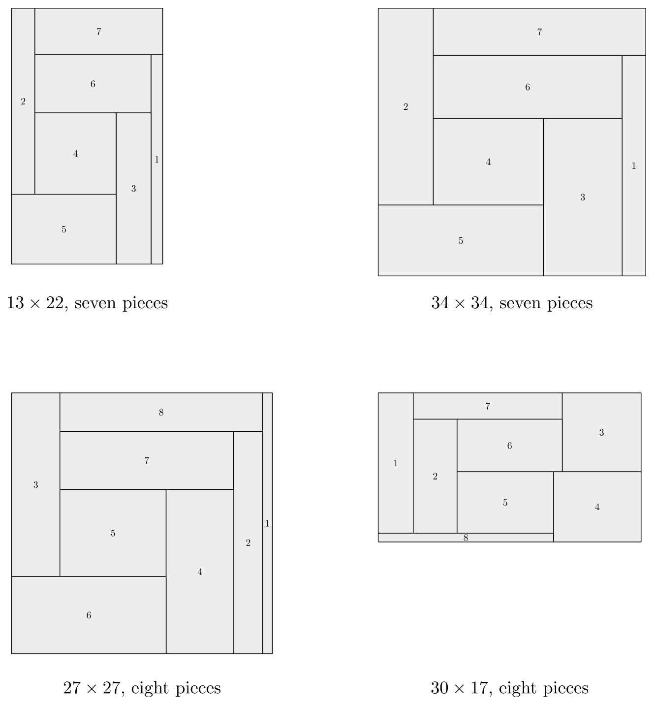

# TAOCP 7.2.2.1, Exercise 375: A Careful Reading

Written 9 September 2026, against Volume 4B, Addison-Wesley, first printing,
2022, and the errata file as of that date.

This is one reader's response to the request on Knuth's [news
page](https://www-cs-faculty.stanford.edu/~knuth/news.html): read an exercise
and its answer very carefully, then report back.

## What I found

| Item | Finding |
| --- | --- |
| Exercise 375 (statement) | No error. |
| The motley counts of exercise 365 (2, 16, 20) | Confirmed, by two independent enumerations. |
| 374(d): order 7 forces one pattern, labeled one way | Confirmed: 1 of the 4 patterns, 1 of its 9 labelings. |
| (a) 52 of the 128 cases are feasible | Confirmed. |
| (a) all the $h$'s first: minimum 68 at $(2,3,4,5,12,13,14,15)$ | Confirmed. |
| (a) the alternating case is infeasible | Confirmed. |
| (a) smallest semiperimeter 35, uniquely, in the case named | Confirmed — and the dissection itself is unique. |
| (a) the next-best case is 43; one case is 103 | Confirmed. |
| (a) squares: 4 of 128 feasible, side 34 at $(3,7,10,14,6,8,9,11)$ | Confirmed, uniquely. |
| (b) the reduction is $4 \times 5$; four labeled diagrams | Confirmed as far as the answers go; see below. |
| (b) best semiperimeters $(44, 44, 44, 56)$ | **The fourth is 47, not 56.** |
| (b) best square sides $(27, 36, 35, 35)$ | Confirmed. |
| (b) 44 by $(4,5,6,7,8,1,2,3,8)$ in the third diagram | Confirmed. |
| (b) side 27 only by $(1,3,5,7,11,4,6,8,9)$ in the first | Confirmed, and it is the only way. |
| (b) an LP optimum of $97/2$ in one case of the second | Confirmed exactly. |
| (b) the integer minimum there is 52, at $(4,6,7,8,9,1,3,5,9)$ | Confirmed. |
| (b) nine subrectangles would be too many | Confirmed: nine need a square of side at least 28. |

Every number in answer 375(a) came out, and every number in (b) but one.



The whole verification runs in about 33 seconds.

## 1. What the exercise asks

A dissection of a rectangle into $t$ subrectangles is *incomparable* if no piece
would fit inside another, even after a quarter turn: writing the two dimensions
of piece $i$ as $\lbrace \min\_i, \max\_i \rbrace$, no two pieces may satisfy
$\min\_i \le \min\_j$ and $\max\_i \le \max\_j$. Exercise 374 develops the
theory. Exercise 375 asks, for seven and for eight pieces and integer sizes,
for the rectangle of smallest semiperimeter (height plus width) and for the
smallest square.

The answer's method is the hint's: fix the way the $t$ heights and the $t$
widths interleave — there are $2^t$ ways — and each case becomes a small linear
program in the independent dimensions.

## 2. Patterns instead of diagrams

Answer 375(b) starts from four labeled diagrams, and answer 374(d) from one.
This program starts a step earlier, by enumerating the patterns those diagrams
are drawn from, so that nothing has to be taken on trust.

The *reduction* of a dissection (exercise 360) squeezes it onto an $m \times n$
grid using every grid line. Incomparability makes two pieces with the same pair
of vertical lines equal in width, hence comparable; so the reduction always has
distinct intervals. It need not be *strictly* reduced — answer 374(b) makes
that point — so the non-strict patterns are kept too, and they turn out to
matter: two of the four order-8 diagrams are non-strict.

Enumerating every dissection of every small grid gives, first, a check on
exercise 365, which says that the motley dissections number 2 at $3 \times 3$,
$8 + 8$ at $4 \times 4$, and $4+4+4+4+2+2$ at $4 \times 5$:

| grid | tilings | reduced | motley | up to symmetry |
| --- | --- | --- | --- | --- |
| 3 × 3 | 322 | 219 | 2 | 1 |
| 4 × 4 | 70,878 | 55,137 | 16 | 2 |
| 4 × 5 | 1,613,060 | 1,286,759 | 20 | 6 |

The tilings are themselves an exact cover problem — one item per cell, one
option per subrectangle — so `ssxcc`, the engine of this repository, counts them
as a second opinion and agrees on all three. (Exercise 365 asks for something
sharper: a construction that makes Algorithm M produce the motley dissections
and nothing else.)

A dissection of order $t$ whose reduction is $m \times n$ has $t = m+n-1$ unless
four pieces meet at a point, and four pieces meeting at a point would give two
of them the same corner. So $m + n \le t+1$, and the census is short: at order 7
only $4 \times 4$ survives, with four patterns, two of them motley; at order 8
only $4 \times 5$, with eighteen patterns, six of them motley.

## 3. Cases, and exact linear programming

Answer 374(a) is the lemma the whole analysis rests on. Sorting the pieces by
their smaller dimension puts their larger dimensions in the opposite order; every
minimum is at most every maximum; so if the $2t$ dimensions in increasing order
are $z\_1 \le \cdots \le z\_{2t}$ then

$$z\_1 < \cdots < z\_t \le z\_{t+1} < \cdots < z\_{2t},$$

and the piece with the $j\text{th}$ smallest minimum has dimensions
$\lbrace z\_j, z\_{2t+1-j} \rbrace$. Label the pieces so that
$w\_1 < \cdots < w\_t$, and then $h\_1 > \cdots > h\_t$.

A *case* is a labeling together with a choice, for each of $z\_1, \ldots, z\_t$,
of whether it is a height or a width; $z\_{2t+1-j}$ is then the other kind. That
fixes the order of all $2t$ dimensions, each of which is a sum of column widths
or of row heights, and what remains is a chain of linear forms increasing by at
least one at every step but the middle one.

Two things follow. First, feasibility is decidable once and for all, with no
bound on the sizes: a case is possible exactly when its linear program is. The
program here is a two-phase simplex over exact rationals with Bland's rule, so
"infeasible" means infeasible and not "not found." Second, the integer optimum
needs branch and bound on top, because the relaxation is not always integral —
which is a point answer 375(b) makes itself.

Which labelings are possible is partly settled by the pattern: a piece using a
subset of another's columns can never be the wider one. That test leaves nine
labelings for the order-7 pattern, and the linear programs kill eight of them.
So answer 374(d)'s conclusion — one pattern, one labeling — comes out:

| order | patterns with distinct intervals | that support an incomparable dissection |
| --- | --- | --- |
| 7 | 4 | 1 (the first $4 \times 4$ motley) |
| 8 | 18 | 6 |

## 4. Order seven

With the diagram of answer 374(d) and its labels, all of 375(a) reproduces:

- **52 of the 128 cases are feasible.**
- The case where all the heights come first has minimum semiperimeter **68**, at
  $h\_7 = 2$, $h\_6 = 3$, $h\_5 = 4$, $h\_4 = 5$, $w\_1 = 12$, $w\_2 = 13$,
  $w\_3 = 14$, $w\_4 = 15$ — the values the answer works out by hand.
- The alternating case is **infeasible**.
- The smallest semiperimeter is **35**, in the case
  $w\_1 < w\_2 < w\_3 < h\_7 < h\_6 < h\_5 < h\_4 \le w\_4 < w\_5 < w\_6 < w\_7 < h\_3 < h\_2 < h\_1$,
  at $w\_1 = 1$, $w\_2 = 2$, $w\_3 = 3$, $h\_7 = 4$, $h\_6 = 5$, $h\_5 = 6$,
  $h\_4 = w\_4 = 7$. Two cases reach 35, which is the
  answer's "or the same case with $w\_4 \leftrightarrow h\_4$" — they are the
  same dissection, since $w\_4 = h\_4$ there.
- **The next-best case is 43**, and one case cannot do better than **103**.
- With the sides forced equal, **4 of the 128** cases survive, and the smallest
  square has side **34**, at
  $(w\_1, w\_2, w\_3, w\_4, h\_7, h\_6, h\_5, h\_4) = (3, 7, 10, 14, 6, 8, 9, 11)$.

Both optima are unique, and that is a statement about dissections rather than
about cases, so it is checked separately by running through every way of
splitting the semiperimeter among the four column widths and the four row
heights: exactly one dissection of semiperimeter 35, exactly one square of side
34. The same brute-force search, given no theory at all, finds nothing at all
for the other three order-7 patterns up to semiperimeter 40, which is what the
linear programs prove outright.

The two dissections are the first two panels of the figure: $13 \times 22$ with
pieces $1 \times 18$, $2 \times 16$, $3 \times 13$, $7 \times 7$, $9 \times 6$,
$10 \times 5$, $11 \times 4$; and $34 \times 34$ with $3 \times 28$,
$7 \times 25$, $10 \times 20$, $14 \times 11$, $21 \times 9$, $24 \times 8$,
$27 \times 6$.

## 5. Order eight, and the fourth diagram

The four labeled diagrams of answer 375(b) were transcribed from the page and
run in the answer's own labeling. Three of them reproduce exactly, witnesses
included:

| diagram | feasible cases | semiperimeter | answer | square | answer |
| --- | --- | --- | --- | --- | --- |
| 1 | 81 of 256 | 44 | 44 | 27 | 27 |
| 2 | 82 of 256 | 44 | 44 | 36 | 36 |
| 3 | 82 of 256 | 44 | 44 | 35 | 35 |
| 4 | 124 of 256 | **47** | **56** | 35 | 35 |

The 44 of the third diagram comes out at
$(w\_1, \ldots, w\_5, h\_8, h\_7, h\_6, h\_5) = (4,5,6,7,8,1,2,3,8)$,
which is the tuple the answer prints, and
the square of side 27 in the first comes out at $(1,3,5,7,11,4,6,8,9)$, also
the answer's, and it is the only way to get it.

The fourth diagram is the one that differs. Its smallest incomparable
dissection has semiperimeter 47, not 56: a $30 \times 17$ rectangle cut into

$$4 \times 16,\ 5 \times 13,\ 9 \times 9,\ 10 \times 8,\ 11 \times 7,\
12 \times 6,\ 17 \times 3,\ 20 \times 1 .$$

Sort those by their smaller dimension and the larger dimensions come out
strictly decreasing — $1 \to 20$, $3 \to 17$, $4 \to 16$, $5 \to 13$,
$6 \to 12$, $7 \to 11$, $8 \to 10$, $9 \to 9$ — so no piece fits inside
another. The areas are $64+65+81+80+77+72+51+20 = 510 = 30 \cdot 17$. It is the
fourth panel of the figure, and it is the fourth diagram exactly: column widths
$(4,5,11,1,9)$ and row heights $(3,6,7,1)$.

Nothing else changes. Three diagrams still reach 44, so the smallest
semiperimeter with eight subrectangles is still 44, and the answer's headline
numbers are unaffected.

### An aside on the count of diagrams

The census finds six patterns of order 8 that support an incomparable
dissection, where the answer draws four diagrams. The gap is in the sentence
"We can place a $4 \times 1$ column at the right of either the $4 \times 4$
pattern or its transpose": a full-height column can go beside any of the four
essentially different orientations of the $4 \times 4$ pattern, giving four
$4 \times 5$ patterns rather than two. The two that are not drawn give
semiperimeter 44 with squares of side 36 and 27 — the same pair of answers as
the second and the first diagram — so the conclusions stand. The other twelve
patterns of order 8 support nothing, and the six motley $4 \times 5$ patterns of
exercise 365 reduce to the two the answer keeps, which is its parenthetical
"the other six patterns can be ruled out."

### The case that is not an integer

Answer 375(b) closes by noting that these linear programs "usually have integer
solutions; but sometimes they don't," and exhibits the case
$h\_8 < h\_7 < w\_1 < h\_6 < w\_2 < w\_3 < w\_4 < h\_5$
of the second diagram. Its LP optimum is
exactly $97/2$, as printed; doubling every gap in the chain scales the problem
by two and turns that fractional vertex into the integer point
$(7,11,13,15,17,3,5,9,17)$, which is the answer's fractional witness times two.
Restricted to integers the minimum rises to 52, achieved at
$(4,6,7,8,9,1,3,5,9)$ — again the answer's.

## 6. Nine subrectangles

The bracketed remark that "no smaller square can be incomparably dissected,
integerwise, because nine subrectangles would be too many" is checkable with the
same machinery. Order 9 has 86 patterns with distinct intervals and 1522
admissible labelings; a relaxed linear program, which drops the interleaving and
asks only that widths rise while heights fall, kills all but 44 of them, and the
$2^9$ cases of those 44 give a smallest square of side **28**. Nine pieces
cannot beat 27.

## 7. Running it

```
cd verify && gtangle verify.w && go run . -mode all
```

Modes: `motley` (the counts of exercise 365), `census` (which patterns can be
made incomparable at all), `seven`, `eight`, `nine`, `direct` (the brute-force
check that uses no theory), and `all`. The literate source is
[verify/verify.w](verify/verify.w) and the typeset program is
[verify/verify.pdf](verify/verify.pdf).
