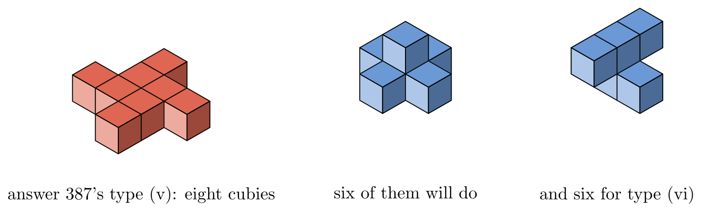

# TAOCP 7.2.2.1, Exercise 387: A Careful Reading

Written 6 September 2026, against Volume 4B, Addison-Wesley, first printing,
2022, and the errata file as of that date.

This is one reader's response to the request on Knuth's [news
page](https://www-cs-faculty.stanford.edu/~knuth/news.html): read an exercise
and its answer very carefully, then report back.

## What I found

| Item | Finding |
| --- | --- |
| Exercise 387 (statement) | No error. |
| The 24 rotations as signed permutations | Confirmed, exactly. |
| Answer 387's worked example, $\bar132$ | All four claims about it hold. |
| 30 subgroups, 11 conjugacy classes | **30** and **11**. |
| 33 types when reflections are allowed | **33**. |
| Class (ii) is the 12 even permutations | Confirmed. |
| Class (ii)'s minimum: 20 cubies, 12 round a core of 8 | Confirmed. |
| Class (iv), one symmetry per permutation | Confirmed. |
| Seven classes from the square's eight types | Confirmed, and "180°" = axial. |
| The example for type (v), 90° | **8 cubies; 6 suffice.** |
| The example for type (vi), bidiagonal | **At least 7; 6 suffice.** |
| "Many of these **twelve** examples" | Should be **eleven**. |

The mathematics of answer 387 is right down to the last count. What comes up
short is the figure: the exercise asks for examples "using the minimum number
of cubies," and two of the eleven drawings use more than the minimum.



Along the way these notes work out something the answer gives for only one of
the eleven types: the minimum number of cubies for each.

The whole verification runs in three seconds.

## 1. What the exercise asks

Exercise 386 lists the eight symmetry types of a polyomino and asks for the
polyiamond and polyhex counts; exercise 387 continues, "how many symmetry types
can a polycube have? Give an example of each type, using the minimum number of
cubies." The parenthesis is the crucial part: "mirror reflection is not a legal
symmetry for a polycube; L-twist = R-twist!" So the group is the 24 rotations
of a cube, not the 48 signed permutations.

A symmetry type is then a conjugacy class of subgroups of that group of 24 —
conjugate subgroups being the same thing seen from another direction.

## 2. The 24 rotations

Answer 387 describes them as the signed permutations of
$\lbrace \pm1, \pm2, \pm3 \rbrace$ for which "the number of inversions of the
permutation plus the number of complementations is even." Generating all 48
signed permutations and comparing that rule against the determinant: the two
descriptions pick out the same 24 matrices, exactly.

The answer then works one out in detail, and every part of it holds:

- $\bar132$ takes $(x,y,z) \mapsto (c-x, z, y)$. Its matrix has determinant
  $+1$ and trace $-1$, so it is a half turn.
- Its axis is the direction $(0,1,1)$, and the affine map fixes the line
  $x = c/2$, $y = z$ — the diagonal line the answer names.
- With $c = 0$ it carries the bent tricube $\lbrace 000, 001, 010 \rbrace$ to
  itself.
- With $c = 1$ it carries the L-twist
  $\lbrace 000, 001, 100, 110 \rbrace$ to itself.

## 3. Thirty subgroups, eleven types

A subgroup is a subset closed under the group operation, so the subgroups can
be found by starting at the identity, throwing in one element at a time and
closing up, until nothing new appears. That gives **30** subgroups of the
rotation group, and sorting them into conjugacy classes gives **11** — both as
the answer says.

The same program applied to all 48 signed permutations gives 98 subgroups in
**33** classes, confirming the aside that "when reflections are allowed, there
are 33 symmetry types(!)".

The eleven come out with the orders and multiplicities that the answer's names
imply, and that is enough to pin each name to a class:

| | type | order | conjugates |
| --- | --- | --- | --- |
| (i) | full | 24 | 1 |
| (ii) | even | 12 | 1 |
| (iii) | 8-fold | 8 | 3 |
| (iv) | 6-fold | 6 | 4 |
| (v) | 90° | 4 | 3 |
| (vi) | bidiagonal | 4 | 3 |
| (vii) | tricentral | 4 | 1 |
| (viii) | 120° | 3 | 4 |
| (ix) | diagonal | 2 | 6 |
| (x) | axial | 2 | 3 |
| (xi) | none | 1 | 1 |

The two classes of order 4 with three conjugates are told apart by whether they
contain a quarter turn: the one that does is 90°, the one that does not is
bidiagonal.

One tiny remark on the sentence before this. The answer says that the subsets
closed under the operation "are the solutions to
$\bigwedge_{x,y \in S}(\lnot x \lor \lnot y \lor (x \star y))$", and that the
BDD "characterizes exactly 30 subgroups." The empty set satisfies every clause,
so the Boolean function has 31 solutions; 30 of them are subgroups, since any
nonempty closed subset contains $a^{|a|}$ = the identity and is a group. The
node count 197 depends on the order in which the 24 variables are tested, which
the answer does not give, so I have not tried to reproduce it.

## 4. What the answer says about three of the types

- **"Class (ii) consists of the 12 symmetries whose permutations are even."**
  Exactly right: the class of order 12 contains every rotation whose
  permutation part is even, and no others.
- **"Class (iv) has one symmetry for each permutation of the three
  coordinates."** Its six elements cover all six permutations, one each.
- **"Classes (iii), (v), (vi), (vii), (ix), (x), (xi) correspond to the eight
  symmetry types of a square, with reflections implemented by turning the
  square over."** A square that may be turned over has the eight rotations that
  fix a coordinate axis. Its subgroups fall into eight conjugacy classes — the
  eight polyomino types — and mapping each into the whole rotation group lands
  them in exactly seven of the eleven classes, namely 8-fold, 90°, bidiagonal,
  tricentral, diagonal, axial and none. The one class that receives two of the
  square's types is **axial**, which is the answer's remark that "the former
  class called 180° is now the same as axial."

## 5. The minimum size of every type

Answer 387 gives this for one type only, in the sentence about class (ii). Here
is the whole table. Two independent methods agree on every entry.

| | type | minimum | a smallest example |
| --- | --- | --- | --- |
| (i) | full | 1 | `000` |
| (ii) | even | **20** | 12 cubies round a 2×2×2 core |
| (iii) | 8-fold | 2 | `000 100` |
| (iv) | 6-fold | 6 | `000 001 010 101 110 111` |
| (v) | 90° | 6 | `011 101 110 111 112 121` |
| (vi) | bidiagonal | 6 | `001 011 021 110 111 112` |
| (vii) | tricentral | 6 | `000 010 020 100 110 120` |
| (viii) | 120° | 4 | `000 001 010 100` |
| (ix) | diagonal | 3 | `000 001 010` |
| (x) | axial | 4 | `001 100 101 201` |
| (xi) | none | 4 | `000 001 002 010` |

The first method is brute force: grow polycubes one cubie at a time, keeping
one representative of each rotation class, and note when each type first turns
up. The counts along the way are 1, 1, 2, 8, 29, 166, 1023, 6922 — the known
number of polycubes under rotation alone — and every type but (ii) appears by
six cubies.

The second reaches (ii) as well. Every symmetry of a polycube carries its
bounding box onto that box, and so fixes the box's centre; the centre has
half-integer coordinates, which become integers when every cubie coordinate is
doubled. So a polycube whose symmetry group is $G$ is a union of orbits of $G$
about that centre, and if it has $n$ cubies then none of them is more than
$n-1$ away from the centre in doubled coordinates, because a connected polycube
of $n$ cubies spans at most $n$ in any direction. Trying the eight centres
modulo 2 and every set of whole orbits that fits therefore misses nothing. It
agrees with brute force on the other ten and gives **20** for (ii), in a third
of a second.

That 20 is exactly what the answer describes: of its twenty cubies, eight form
a 2×2×2 block and the other twelve surround it.

## 6. Two of the pictures are bigger than they need to be

Counting cubies in a small isometric drawing is not something to trust the eye
with, but one feature of such a drawing can be counted safely: the shaded top
faces. A drawing shows one top face for each column of the polycube along
whichever direction is drawn as vertical, so **the number of top faces is the
number of columns**, and the most an $n$-cubie polycube can ever show is the
largest of its three projections.

I read the top faces off the printed figure by looking for connected patches of
the colour reserved for them. Then:

| | type | minimum | most top faces a minimal one can show | the drawing shows |
| --- | --- | --- | --- | --- |
| (i) | full | 1 | 1 | 1 |
| (ii) | even | 20 | — | 10 |
| (iii) | 8-fold | 2 | 2 | 2 |
| (iv) | 6-fold | 6 | 4 | 3 |
| (v) | 90° | 6 | 5 | **8** |
| (vi) | bidiagonal | 6 | 5 | **6** |
| (vii) | tricentral | 6 | 6 | 6 |
| (viii) | 120° | 4 | 3 | 3 |
| (ix) | diagonal | 3 | 3 | 3 |
| (x) | axial | 4 | 4 | 4 |
| (xi) | none | 4 | 4 | 4 |

Nine of the eleven are consistent with the minimum. Two are not.

**Type (v), 90°.** Its picture can be read off completely, not merely bounded.
Its eight top faces are complete, unoccluded rhombi, and fitting them to the
drawing's projection puts all eight at the same height, so the polycube is one
layer deep and has exactly eight cubies. Recovering their positions gives a
flat pinwheel, and that shape does have symmetry type 90°. But six cubies
suffice: take the plus pentomino and stand one cubie on its centre. That is the
middle polycube in the picture above, and its symmetry group is the cyclic
group of order 4 and nothing more.

**Type (vi), bidiagonal.** Its picture shows six top faces — four full rhombi
and two slivers, far enough apart that they cannot be two pieces of one face.
No six-cubie polycube of that type can show more than five, so the drawing has
at least seven cubies. Six suffice, and one that does is on the right above.

Nothing else in the answer depends on either drawing.

## 7. "Many of these twelve examples"

The bracketed note that closes answer 387 begins "Many of these twelve examples
have reflective symmetries too; but those don't count." There are eleven
examples: the answer says so itself two sentences earlier — "there are 11 of
them" — and the figure is labelled (i) through (xi). So **twelve** should read
**eleven**.

## 8. What I checked before reporting this

- The eleven minima were computed twice over, by two methods sharing no code
  path: growing every polycube up to eight cubies, and the orbit search. They
  agree on all ten that brute force can reach.
- The completeness of the orbit search rests on the bounding-box centre, which
  is fixed by every symmetry because a symmetry maps the bounding box onto
  itself. The box bound $n-1$ in doubled coordinates is likewise forced, since
  a connected polycube of $n$ cubies spans at most $n$ in any direction.
- The polycube counts 1, 1, 2, 8, 29, 166, 1023, 6922 came out of the growing,
  and match the published sequence, which is a check on the canonical form.
- Every claimed example was fed back through the symmetry-group routine, so
  each one is confirmed to have exactly the group claimed and no more.
- The top faces in the printed figure were counted mechanically, by connected
  components of the top-face colour, not by eye; the eleven groups separated
  cleanly and lined up one-to-one with the eleven labels.
- The recovered type (v) polycube was checked to have type 90° and eight
  cubies, so the discrepancy is not an artefact of the reading.
- I also checked the errata file for Volume 4B; it has nothing on exercise 387
  or its answer.

## 9. Method

The verification is a literate program, [`verify/verify.w`](verify/verify.w),
typeset as [`verify/verify.pdf`](verify/verify.pdf). This exercise needs no
exact cover, so it uses none of this repository's engines — it is here because
it belongs with the other readings.

```text
make                            # tangles and builds
cd taocp-7.2.2.1-exercises/387/verify && go run verify.go -mode all
```

| Mode | What it does | Time |
| --- | --- | --- |
| `-mode group` | section 2 | instant |
| `-mode types` | sections 3 and 4 | 1.1 s |
| `-mode grow` | section 5, brute force | 1.4 s at `-top 8` |
| `-mode min` | section 5, orbit search | 0.4 s |
| `-mode printed` | section 6 | instant |

The figure is drawn once, in [`verify/polycubes.mp`](verify/polycubes.mp):
luamplib runs it while the document is typeset, and `mpost` runs it again to
make the picture this page shows.

## References

- D. E. Knuth, *The Art of Computer Programming*, Volume 4B, §7.2.2.1,
  exercises 386 and 387 and their answers.
- W. F. Lunnon, "Symmetry of cubical and general polyominoes", in *Graph Theory
  and Computing* (Academic Press, 1972), 101–108.
