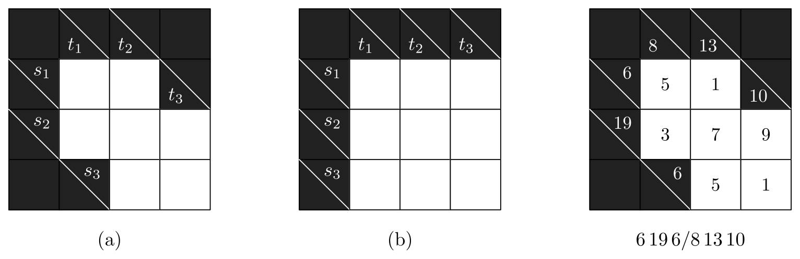

# TAOCP 7.2.2.1, Exercise 432: A Careful Reading

Written 6 September 2026, against Volume 4B, Addison-Wesley, first printing,
2022, and the errata file as of that date.

This is one reader's response to the request on Knuth's [news
page](https://www-cs-faculty.stanford.edu/~knuth/news.html): read an exercise
and its answer very carefully, then report back.

## What I found

| Item | Finding |
| --- | --- |
| Exercise 432 (statement) | No error. |
| (a) 1432872 fillings, patterns (5, 28, 33, 11, 1) | Both confirmed. |
| (a) 78690 sum sequences unique, about 5.5% | **78690**, 5.492%. |
| (a) 9932 classes: 1, 190, 9741 | **9932** = 1 + 190 + 9741. |
| (a) the one with four symmetries | **6 15 14/14 15 6**. |
| (b) 43038576 fillings, (2, 42, …, 18, 1) | Both confirmed. |
| (b) 6840 unique, about 0.016% | **6840**, 0.016%. |
| (b) 49 classes, all but 3 asymmetric | **49**, and **3**. |
| (b) the three symmetric ones | All three named correctly. |
| (b) forced by 7 opposite 20, or its dual | True of **all 49**. |
| (a) four forced moves in each easy puzzle | Confirmed, given a reading. |
| (a) list of possible second rows | **One short**: 231 is missing. |
| (a) 4011 asymmetric with no forced move | **Cannot exceed 3360**; here 3172. |
| (a) 570 of those with no magic block | **576**. |
| (a) hardest puzzle 6 19 6/8 11 10 | **No such puzzle exists.** |

Almost every number in answer 432 comes out exactly, and so do the names of the
symmetric puzzles, which is a good check that the diagrams are being read the
same way. The last four rows are the exceptions, and the last of them is the
plainest: the puzzle the answer calls the hardest cannot exist, because its
across clues total 31 and its down clues total 29, and both of those totals are
the sum of the same seven digits.



The whole verification runs in about twenty seconds.

## 1. What the exercise asks

Kakuro clues are block sums. The exercise observes that you cannot make a
puzzle by filling the blanks at random and reading off the sums, because
"the vast majority of feasible sums yield nonunique solutions," and asks for
the experiment on two small diagrams: (a) a seven-cell staircase whose blocks
have lengths 2, 3, 2 in both directions, and (b) a plain 3 × 3. For each, count
the fillings, count how many are reconstructible from their sums, and take
symmetry into account.

Answer 432 writes a puzzle's clues as $s_1s_2s_3/t_1t_2t_3$, the across sums
first. The picture above names them.

## 2. The fillings, and the patterns

Walking every filling with no digit repeated in a block gives **1,432,872** for
diagram (a) and **43,038,576** for (b), exactly the answer's totals.

The answer arrives at them by patterns rather than digits: a filling is
described by which cells match, and a pattern using $k$ classes can be given
digits in $9^{\underline{k}}$ ways. Dividing the fillings by the falling
factorial recovers the answer's counts on the nose:

| classes | 3 | 4 | 5 | 6 | 7 | 8 | 9 |
| --- | --- | --- | --- | --- | --- | --- | --- |
| (a), answer | 5 | 28 | 33 | 11 | 1 | | |
| (a), here | 5 | 28 | 33 | 11 | 1 | | |
| (b), answer | 2 | 42 | 186 | 234 | 105 | 18 | 1 |
| (b), here | 2 | 42 | 186 | 234 | 105 | 18 | 1 |

## 3. One missing string

Answer 432 sketches diagram (a)'s patterns directly:

> we can assume that the top row is '12'; then the second row is either '213'
> or '234' or '312' or '314' or '34x' for $1 \le x \le 5$

The three cells of the second row lie in one block, so they must differ; '343'
and '344' are out and that list names seven strings. Growing the patterns gives
**eight**:

```text
213   231   234   312   314   341   342   345
```

**231** is missing from the answer's list. The totals that follow it are right,
so nothing else depends on this; the sentence is one entry short.

## 4. Which sums make a puzzle

A sum sequence is a puzzle when exactly one filling produces it. Counting the
sequences and keeping those seen once:

| | fillings | distinct sequences | unique | share |
| --- | --- | --- | --- | --- |
| (a) | 1,432,872 | 356,215 | **78,690** | 5.492% |
| (b) | 43,038,576 | 1,077,469 | **6,840** | 0.016% |

which is the answer's 78690 "about 5.5%" and 6840 "≈ 0.016%".

## 5. Equivalent puzzles

Every diagram here has two symmetries of its clues. The **dual** replaces each
clue $s$ on a block of length $k$ by $10k - s$, and is solved by changing every
digit $d$ to $10 - d$. The **transpose** exchanges the across clues with the
down ones. Diagram (a) has one more, the half turn, which reverses both
triples; diagram (b), being square, allows its three rows and its three columns
to be permuted freely. So the groups have order 8 and 144, and the classes come
out as the answer says:

| | classes | asymmetric | 2 symmetries | 4 symmetries |
| --- | --- | --- | --- | --- |
| (a) | **9932** | 9741 | 190 | 1 |
| (b) | **49** | 46 | 3 | — |

The single four-symmetry class of (a) is **6 15 14/14 15 6**, exactly the one
the answer names. The three symmetric classes of (b) come out as **7 11
20/7 11 20**, **7 19 20/7 19 20** and **7 15 23/10 15 20** — again the answer's
three, and the first two are indeed fixed by the transpose while the third is
fixed by the dual once its rows and columns are put back in order.

Those three arithmetics agreeing independently is the best evidence I have that
my reading of the diagrams matches Knuth's.

## 6. What a forced move must mean

Answer 432 uses the term without defining it, but three of its remarks pin the
meaning down between them. A solver looking at a fresh diagram can fill a cell
in at once in two ways:

- a **naked single** — the two blocks through the cell can only agree on one
  digit; or
- a **hidden single** — a magic block (answer 430(b): a block whose clue admits
  only one combination) has a digit that fits in only one of its cells.

Count both, and the answer's three examples come out exactly right:

| puzzle | the answer says | here |
| --- | --- | --- |
| 5 19 6/6 10 14 | "a forced move in the lower right corner" | **1**, there |
| 4 15 12/12 15 4 | "four forced moves" | **4** |
| 4 15 16/12 15 8 | "four forced moves" | **4** |

The first of those also settles that a naked single counts as a forced move,
because that puzzle has no magic block at all, so its corner cannot be a hidden
single.

## 7. Two counts that cannot both be right

The answer continues: "Altogether 4011 of the asymmetric puzzles have no forced
moves. And of those, 570 have no 'magic blocks.'"

Neither reproduces. With the reading of section 6 the numbers are **3172** and
**576**. But 4011 is not merely different — it is too large for any reading
under which a naked single is a forced move, and section 6 shows that it is:

- only **3360** of the 9741 asymmetric puzzles of diagram (a) have no naked
  single anywhere;
- a puzzle with a naked single has a forced move;
- so at most 3360 asymmetric puzzles can have no forced move.

Adding hidden singles takes that 3360 down to 3172, never up. Whatever the
intended definition, 4011 is out of reach.

## 8. The hardest puzzle cannot exist

The sentence ends: "And of those, puzzle 6 19 6/8 11 10 is the hardest, in the
sense that it maximizes the number of nodes (79) in Algorithm C's search tree."

**6 19 6/8 11 10 is not a puzzle.** Its across clues add to $6 + 19 + 6 = 31$
and its down clues to $8 + 11 + 10 = 29$; both are the sum of the same seven
digits, so they must agree. No filling of the diagram has those clues.

Changing one clue repairs it in six ways, and only one of them lands where the
answer says the hardest puzzle should:

| repair | result |
| --- | --- |
| 4 19 6/8 11 10 | 2 solutions |
| 6 17 6/8 11 10 | 5 solutions |
| 6 19 4/8 11 10 | unique, but it has a magic block |
| 6 19 6/10 11 10 | 6 solutions |
| **6 19 6/8 13 10** | **unique, asymmetric, no forced move, no magic block** |
| 6 19 6/8 11 12 | 2 solutions |

So the puzzle meant is almost certainly **6 19 6/8 13 10**, one digit from what
was printed. It is drawn and solved in the third panel at the top of these
notes, and it is genuinely hard: no cell gives itself away.

## 9. Node counts

Answer 432 measures difficulty by the size of Algorithm C's search tree, "using
the construction of answer 430(d)." That construction is implemented here and
checked twice over: it solves the mini-kakuro of exercise 430 uniquely with a 5
in the lower right corner, as answer 430(a) says, and it solves the generalized
kakuro of exercise 430(c) uniquely with 7 9 8 down the middle, as answer 430(c)
says.

The node counts themselves do not carry over. This repository's Algorithm C
reports 75 nodes for 6 19 6/8 13 10 where the answer says 79, and 388 for the
4 × 4 puzzle 11 15 23 29/12 15 23 28 of the closing note where the answer says
488. That is a fact about the two programs rather than about the puzzles: they
break ties between equally promising items differently, so they walk different
trees. The 4 × 4 puzzle does have the single solution the note implies.

## 10. What I checked before reporting this

- The reading of the diagrams was confirmed three ways before anything else was
  believed: the two filling totals, the two pattern distributions, and the
  names of all four symmetric puzzles the answer singles out.
- The impossible puzzle needs no program at all — the two totals of its clues
  differ — and the exact cover solver agrees, finding no solution.
- The bound of section 7 was computed from naked singles alone, so it does not
  depend on the hidden-single rule; and the hidden-single rule was adopted only
  because it reproduces all three of the answer's own forced-move counts.
- The exact cover construction was validated against two puzzles from exercise
  430 whose answers are stated in the book, before being used for anything
  here.
- I also checked the errata file for Volume 4B; it has nothing on exercise 432
  or its answer.

## 11. Method

The verification is a literate program, [`verify/verify.w`](verify/verify.w),
typeset as [`verify/verify.pdf`](verify/verify.pdf). The searches use the XCC
engine of this repository — Knuth's Algorithm C, dancing cells rather than
dancing links.

```text
make                            # tangles and builds
cd taocp-7.2.2.1-exercises/432/verify && go run verify.go -mode all
```

| Mode | What it does | Time |
| --- | --- | --- |
| `-mode fill` | sections 2 and 4 | 4 s |
| `-mode rgs` | section 3 | instant |
| `-mode classes` | section 5 | 7 s |
| `-mode forced` | sections 6 and 7 | 8 s |
| `-mode cover` | section 9 | instant |
| `-mode hard` | section 8 | instant |

The figure is drawn once, in [`verify/kakuro.mp`](verify/kakuro.mp): luamplib
runs it while the document is typeset, and `mpost` runs it again to make the
picture this page shows.

## References

- D. E. Knuth, *The Art of Computer Programming*, Volume 4B, §7.2.2.1,
  exercises 430 and 432 and their answers.
