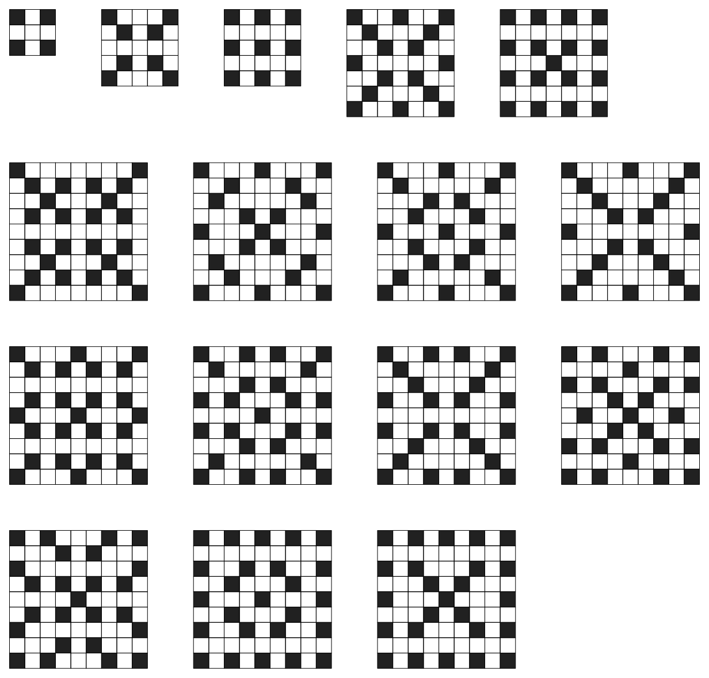

# TAOCP 7.2.2.1, Exercise 442: A Careful Reading

Written 7 September 2026, against Volume 4B, Addison-Wesley, first printing,
2022, and the errata file as of that date.

This is one reader's response to the request on Knuth's [news
page](https://www-cs-faculty.stanford.edu/~knuth/news.html): read an exercise
and its answer very carefully, then report back.

## What I found

| Item | Finding |
| --- | --- |
| Exercise 442 (statement) | No error. |
| The 9 × 9 matrix of totals, all 81 entries | **All confirmed.** |
| Black cells `[fewest..most]`, 81 entries | 80 confirmed; **(1,1) is wrong** |
| Covers with both mirrors, all 81 entries | **All confirmed.** |
| 8-fold symmetric: (1,0,1,0,2,0,2,0,11) | Confirmed. |
| 90° but not 8-fold: (0,0,0,1,1,3,11,30,106) pairs | Confirmed. |
| Both diagonals, not 8-fold: (0,0,0,0,0,1,4,9,49) pairs | Confirmed. |
| Even × even impossible, and the reason given | Confirmed. |
| 2 × *n*: *X*(*n*) = 2*X*(*n*−2) + 2*X*(*n*−3), *r* ≈ 1.76929 | Confirmed. |
| ZDD sizes 203402 → 55038 → 1145647 at *m* = *n* = 9 | **Not reproduced.** |

Answer 442 is a dense page of numbers — 81 totals, 81 ranges, 81 symmetry
counts, three vectors of nine, a recurrence, a growth constant, and three
diagram sizes — and every one of the counts comes out exactly. The two rows
that are not plain confirmations are the last two, and only one of them is an
error: a single entry in the range matrix that contradicts the book elsewhere.



The whole verification runs in about two minutes.

## 1. What the exercise asks

> **442.** [*M33*] Enumerate all hitori covers of Pm □ Pn, for
> 1 ≤ *m* ≤ *n* ≤ 9.

A *hitori cover* is defined three exercises earlier:

> **439.** [*M20*] Let *G* be a graph on the vertices *V*. A hitori cover of
> *G* is a set *U* ⊆ *V* such that (i) *G* | *U* is connected; (ii) if *v* ∉
> *U* and *u* — *v* then *u* ∈ *U*; (iii) if *u* ∈ *U* and if *v* ∈ *U* for
> all *u* — *v*, then *G* | (*U* \ *u*) is not connected.

Answer 439(a) reads that back in standard terms, and the reading is worth
having in front of you before writing any code: (ii) says *U* is a vertex
cover, so (i) and (ii) together say it is a **connected vertex cover**, and
(iii) makes it a **minimal** one. In hitori terms *U* is the white cells. They
hang together; no two black cells touch; and no further cell can be blackened.

Condition (iii) is the one that is easy to drop by accident. Without it the
6 × 6 board has 1,646,096 covers instead of 46,416, and nothing matches.

## 2. How the answer says to compute them, and how we did

Answer 442 gives the recipe:

> A "frontier-based" algorithm analogous to those of answers 7.1.4–55 and
> 7.1.4–225 will produce an unreduced ZDD for the family *f*↑ of all
> complements *V* \ *U* of connected vertex covers, from which a variant of
> Algorithm 7.1.4R will give a ZDD. Then the NONSUB subroutine of answer
> 7.1.4–237 will produce a ZDD for *f*, the complements of hitori covers.

We follow it exactly. [`verify/verify.w`](verify/verify.w) walks the cells in
row-major order, carrying a frontier one row wide that records, for each
column, whether the last decided cell there is black and if not which white
component it belongs to. States are memoized, which is what makes the walk a
diagram rather than a search; the diagrams themselves come from
[`sjnam/bdd`](https://github.com/sjnam/bdd), a Go rendering of Knuth's
`BDD15`.

The one step where we part from the recipe is `NONSUB`, and it turns out not
to be needed. Removing a black cell from a set that satisfies (i) and (ii)
keeps it independent, and hands the white region one more cell all of whose
neighbours are already white, so the region stays connected. **The family is
therefore closed downwards**, and a member fails to be maximal exactly when it
is some member with one element removed. That family is the union of the
quotients *f*/*v*, so the maximal members are

```go
sub := z.Empty()
for v := 0; v < m*n; v++ {
    sub = z.Union(sub, z.Quotient(f, z.Elt(v)))
}
h := z.Diff(f, sub)
```

two lines of family algebra instead of a special subroutine.

## 3. The totals

All 81 entries agree with the printed matrix, the 9 × 9 corner included:

```text
n = 1 .. 5
        1        2        1        1        1
        2        4        6       12       20
        1        6       11       30       75
        1       12       30      110      382
        1       20       75      382     1804
        1       36      173     1270     7888
        1       64      434     4298    36627
        1      112     1054    14560   166217
        1      200     2558    49204   755680

n = 6 .. 9
           1           1           1           1
          36          64         112         200
         173         434        1054        2558
        1270        4298       14560       49204
        7888       36627      166217      755680
       46416      287685     1751154    10656814
      287685     2393422    19366411   157557218
     1751154    19366411   208975042  2255742067
    10656814   157557218  2255742067 32411910059
```

The frontier reaches 32,411,910,059 in under three seconds. As a check on the
whole apparatus — the frontier, the memoization, the quotient trick, and the
reading of the definition — the program also settles every board up to 6 × 6
by looking at each of its independent sets in turn and testing the three
conditions literally. That is a program sharing none of the machinery, and on
all 21 boards it agrees, on both the totals and the ranges.

## 4. The one wrong entry: the 1 × 1 board

The left-hand matrix of further statistics gives, for each board, the fewest
and the most black cells a cover can have. Eighty of its 81 entries are
confirmed. The exception is the corner:

| | book | here |
| --- | --- | --- |
| 1 × 1 | `[1..1]` | `[0..0]` |

Both readings give **one** cover, so the totals matrix is unaffected. What
differs is which cover it is, and that turns on whether the null graph counts
as connected.

- If the null graph is **connected**, then *U* = ∅ satisfies (i) vacuously and
  (ii) vacuously, while *U* = {*v*} fails (iii), because *G* | ∅ would be
  connected. The unique cover blackens the cell: `[1..1]`, as printed.
- If the null graph is **not connected**, *U* = ∅ fails (i) and *U* = {*v*}
  passes (iii). The unique cover leaves the cell white: `[0..0]`.

The book settles it elsewhere. Answer 441 says that "when *n* = 1 any single
letter *a* is trivially a valid puzzle," and exercise 439(b) says that the
solution of a valid hitori puzzle is a hitori cover. The solution of the
one-cell puzzle `a` leaves its cell white — there is no duplicate to remove —
so *U* = {*v*} **is** a hitori cover of P1 □ P1, and
the entry should be `[0..0]`.

Put the other way round: answer 442's `[1..1]` and answer 441's valid one-cell
puzzle cannot both be right. It is a one-cell corner of a 45-board table, but
it is the kind of thing this exercise is for.

## 5. Symmetry

The right-hand matrix counts the covers fixed by both mirrors. All 81 entries
agree:

```text
     1     0     1     1     1     1     1     1     1
     0     0     0     0     0     0     0     0     0
     1     0     3     2     5     1     6     2    10
     1     0     2     0     2     0     2     0     2
     1     0     5     2    10     2    21     1    46
     1     0     1     0     2     0     1     0     2
     1     0     6     2    21     1    48     1   150
     1     0     2     0     1     0     1     0     3
     1     0    10     2    46     2   150     3   649
```

So do the three vectors for square boards: **8-fold** symmetric covers number
(1, 0, 1, 0, 2, 0, 2, 0, 11) — the seventeen patterns in the figure above —
and there are (0, 0, 0, 1, 1, 3, 11, 30, 106) pairs with 90° rotational
symmetry but not 8-fold, and (0, 0, 0, 0, 0, 1, 4, 9, 49) pairs symmetric
about both diagonals but not 8-fold.

Counting these needs no diagram: a cover fixed by a group is a union of orbits
of cells, an orbit that touches itself can never be black, and after that
pruning the walk is over in an instant.

## 6. The two claims in prose

**"Fourfold horizontal and vertical symmetry is impossible when *m* and *n*
are both even, because it forces at least 12 white cells near the center."**
Confirmed, and the reason is exactly right. With both mirrors and both
dimensions even there is no middle row and no middle column, so the central
2 × 2 block is a single orbit — and two of its cells are adjacent, so it
cannot be black. Each of the eight cells around that block lies in an orbit
containing its own mirror image next door, for the same reason. Twelve cells
are therefore white, and the middle four of them have no black neighbour and
are not cut vertices, so no such cover is maximal. The program checks the
twelve-cell claim itself, not merely the conclusion, on every even × even
board up to 8 × 8.

**"The number of 2 × *n* hitori covers can readily be shown to satisfy the
recurrence *X*(*n*) = 2*X*(*n*−2) + 2*X*(*n*−3), growing as Θ(*r*ⁿ) where
*r* ≈ 1.76929."** Confirmed. The recurrence holds without exception for
*n* = 4 through 24, well past the nine columns the exercise asks about:

```text
2, 4, 6, 12, 20, 36, 64, 112, 200, 352, 624, 1104, 1952, 3456, ...
```

and the real root of *x*³ = 2*x* + 2 is 1.769292354, with
*X*(24)/*X*(23) = 1.769298 already.

## 7. The diagram sizes, which we do not reproduce

For *m* = *n* = 9 the answer reports an unreduced ZDD of size 203402, reduced
to 55038 nodes, and then a ZDD of size 1145647 for the family of maximal black
cells, at a cost of 550 Gμ. Our construction gives 47097 frontier states,
14313 nodes for the first family and 319385 for the maximal one, in 2.8
seconds.

This is **not** offered as a correction. A reduced ZDD is canonical only once
the order of its variables is fixed, and the answer does not say what order
its frontier used; ours is row-major over the cells, and reversing it (the
only other order our program can express) gives the same sizes, since that is
just turning the board upside down. The counts read off both diagrams agree in
all 81 places, which is the part that matters. But somebody with Knuth's
program could say in a minute where the factor of about 3.6 comes from, and it
would be interesting to know.

## 8. Running it

```sh
cd taocp-7.2.2.1-exercises/442/verify
gtangle verify.w && go run verify.go            # every mode, about two minutes
go run verify.go -mode counts                   # the two matrices
go run verify.go -mode brute -n 6               # the independent check
go run verify.go -mode sym                      # the symmetry statistics
go run verify.go -mode claims                   # the twelve white cells
go run verify.go -mode two                      # the 2 x n recurrence
go run verify.go -mode gallery                  # the eightfold covers
```

Every mode takes `-n` to cut the boards down; `-n 6` makes the whole run
instant and still exercises everything.
